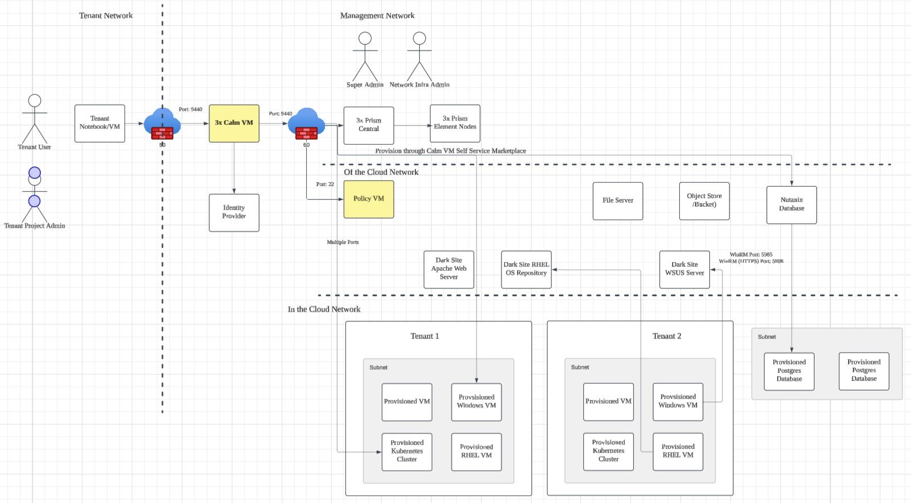
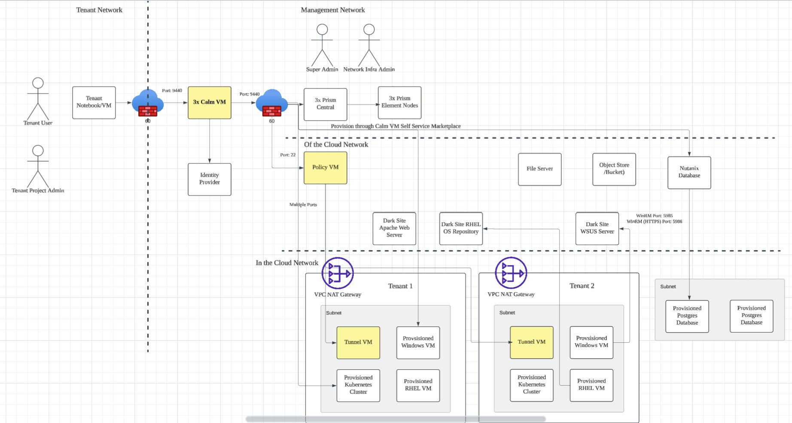

# Product Configurations:

1.  Calm VM 4.2.0 on PC7.3
2.  Infrastructure cluster on AOS 7.3 on PC7.3

# Lab Architecture

The lab architecture comprises of the following components:

1.  Calm VMs provides the tenant facing marketplace self Service
2.  Prism Central provides the management of Nutanix Cluster
3.  Policy VM provides the quota, approval and scheduler Service
4.  Tunnel VM (applicable for VPC only) to allow remote execution of the VM within a NAT VPC

The lab may be setup where the VMs are either provisioned into VLAN or VPC.  Please check with the leader of the lab.

## Lab Architecture where VMs are provisioned into VLAN

 

## Lab Architecture where VMs are provisioned into VPC

 

# Three/Four node HPOC clusters

Three or four node Hosted POC clusters follow a standard naming convention depending on where it is based. 

For example for PHX based clusters

- **Cluster Name** - PHX-POC024
- **Subnet** - 10.42.24.0
- **Cluster IP** - 10.42.24.37 for the VIP of the Cluster

For example for DM3 based clusters

- **Cluster Name** - DM3-POC024
- **Subnet** - 10.55.24.0
- **Cluster IP** - 10.55.24.37 for the VIP of the Cluster

Each cluster is configured with 2 VLANs which can be used for VMs:

|Network Name        | Address             | VLAN    | DHCP Scope |
|------------------- | ------------------- |-------- | -----------|
|Primary_xx          | 10.*ABC*.*XYZ*.1/25    | 0       | 10.*ABC*.*XYZ*.40-10.*ABC*.*XYZ*.99|
|Secondary_xx        | 10.*ABC*.*XYZ*.129/25  | *XYZ1*  | 10.*ABC*.*XYZ*.140-10.*ABC*.*XYZ*.250|

 

