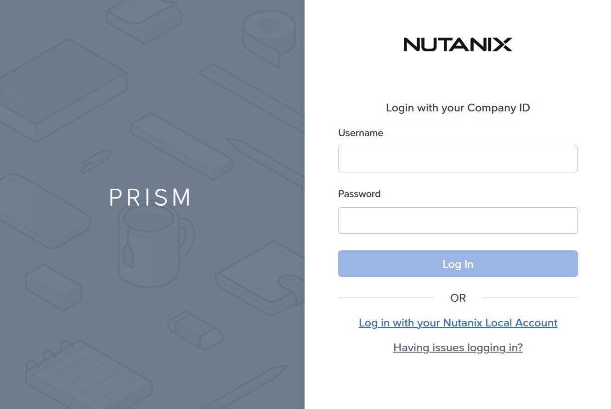
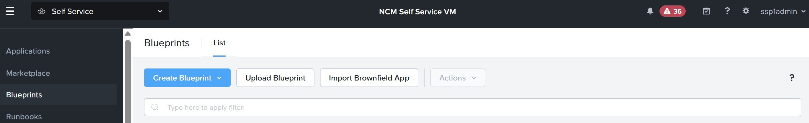

# Product Configurations:

1.  Calm VM 4.2.0 on PC7.3
2.  Infrastructure cluster on AOS 7.3 on PC7.3

## Lab Architecture

The lab architecture comprises of the following components:

1.  Calm VMs provides the tenant facing marketplace self Service
2.  Prism Central provides the management of Nutanix Cluster
3.  Policy VM provides the quota, approval and scheduler Service
4.  Tunnel VM (applicable for VPC only) to allow remote execution of the VM within a NAT VPC

The lab may be setup where the VMs are either provisioned into VLAN or VPC.  Please check with the leader of the lab.

### Lab Architecture where VMs are provisioned into VLAN

 

### Lab Architecture where VMs are provisioned into VPC

 

 ### Login Page of the Calm VM

 Logging into the Calm VMs is the entry point for the lab.  Please refer to the Google spreadsheet provided by the leader 
 of the lab for both the url and login credential.  All login are using domain credential unless otherwise stated.

1.  Login using SSP Admin username provided in the Google spreadsheet.  An example is ssp1admin@ntnxlab1.local  
  
  

2.  This picture is an example of successful login 

  

