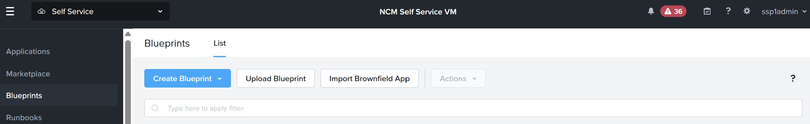

# Product Configurations:

1.  NCM Self Service VM 4.2.0 on PC7.3
2.  Infrastructure cluster on AOS 7.3 on PC7.3

## Role Based Access in Project

Both configurations (NCM Self Service VM and NCM Self Service in Prism Central) leverages on the built in roles provided in Prism Central.  These are 
the specific role available for NCM Self Service

     

## Active Directory

The AD services for the **NTNXLAB1.local** domain. The domain is populated with the following Users and Groups.  Replace XYZ with the username and password provided by the leader of the workshop

  <table className="table custom-table compact">
    <thead>
      <tr>
        <th>Group</th>
        <th>Role</th>
        <th>Username</th>
      </tr>
    </thead>
    <tbody>
      <tr>
        <td>SSPAdmin</td>
        <td>Self-Service Admin</td>
        <td>sspXYZadmin</td>
      </tr>
      <tr>
        <td>SSPProjectAdmin</td>
        <td>Project Admin</td>
        <td>tenantXYZprojadmin</td>
      </tr>
      <tr>
        <td>SSPDeveloper</td>
        <td>Consumer</td>
        <td>tenantXYZdeveloper</td>
      </tr>
      <tr>
        <td>SSPBPDeveloper</td>
        <td>Developer</td>
        <td>tenantXYZBPdeveloper</td>
      </tr>
    </tbody>
  </table>

## Login Page of the Self Service

 Logging into the Self Service is the entry point for the lab.  Please refer to the Google spreadsheet provided by the leader 
 of the lab for both the url and login credential.  All login are using domain credential unless otherwise stated.

1.  Login using SSP Admin username provided in the Google spreadsheet.  An example is ssp20admin@ntnxlab1.local  
  
  

2.  This picture is an example of successful login.  

  

#  Login using SSP Project Admin username provided in the Google spreadsheet.  An example is tenant20projadm@ntnxlab1.local

# 

#   This picture is an example of successful login.  

# 
