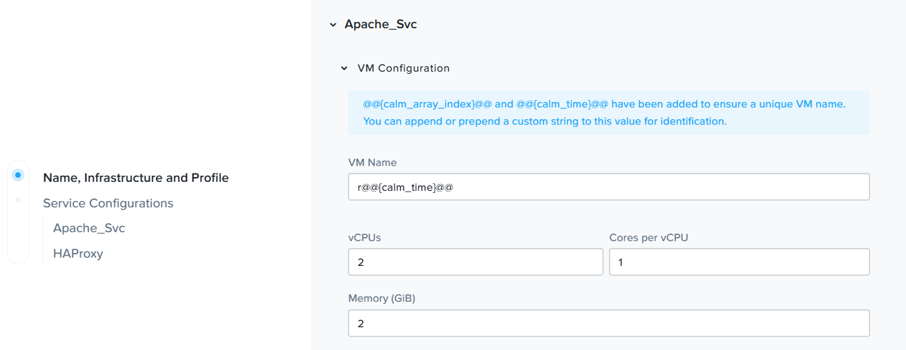
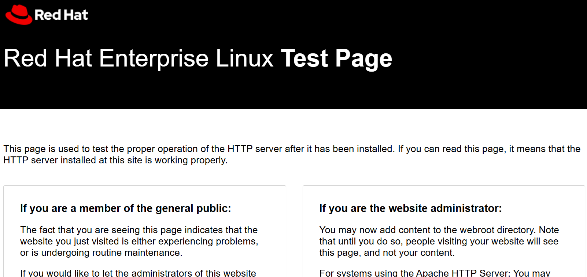

# Product Configurations:

1.  Calm VM 4.2.0 on PC7.3
2.  Infrastructure cluster on AOS 7.3 on PC7.3

## Objectives:

The objectives of this lab is to understand the lifecycle of the HAProxy Apache application

1.  Provision the HAProxy Apache Application from the marketplace  
2.  Day 2 action to scale out and scale in  

## Provision HAProxy Apache applications from the marketplace

1. On the left side of the screen, click on **Marketplace**

    

2.  Click on **GET** in **ApacheRHEL** to launch the HAProxy Apache Application

    

3.  Click on **Deploy**

    

4.  Fill in the following:

a.  Application Name:  Apache-**Trainee Name**  
b.  Environment: **Choose the environment assigned to you as specified in the lab sheet**  

     

5.  Scroll down.  Observe the **application profile**.  Application Profile allows the blueprint designer
to design T-shirt sizing or cloud (AWS, Azure, GCP, VMware) in the blueprint.

    

6.  Scroll down.  Observe the default VM sizing defined for the Apache Service.  The value is editable.
**Do not change the value for this lab.**

    

7.  Scroll down.  Every VM is provisioned using an AHV disk image.

    

8.  Scroll down and observe likewise for HAProxy.  Click on **Deploy**

    

9.  Click **View in Application**.

    

10.  The application provisioning is estimated to take 5 to 10 mins.  Have a coffee break

    

11.  Click on **Audit**

    

12.  The application is provisioned successfully

    

## Verify the HAProxy Apache applications

1.  Click on **Services**.  Observe both the Apache and HAProxy Services were provisioned.  
Click on the **>** icon in **Apache Service** to expand the Apache service

    

2.  Observe 3 Apache web servers are provisioned.  

    

3.  On the right hand side of the screen, the **Apache** Service IP addresses are shown.

    

4.  Click on **HAProxy** service.  Observe the **HAProxy** Service IP address is shown

    

5.  Open a new browser window.  Put in the **HAProxy** IP address.  Observe the page as shown below

    

