# Product Configurations:

1.  NCM Self Service VM 4.2.0 on PC7.3
2.  Infrastructure cluster on AOS 7.3 on PC7.3

## Objectives:

The objectives of this lab is to understand how the the HAProxy Apache application can be scale out and 
in.  

Alert can be configured in **NCM Intelligent Operation** to monitor the CPU or Memory utilization of 
the HAProxy to trigger the scale out or scale in action.  Dynamic scale out & scale in will not be 
discussed in this lab.  Please raise a question to the instructor on this.

## Scale out the HAProxy Apache applications

1.  Click on **Manage** in the application.

    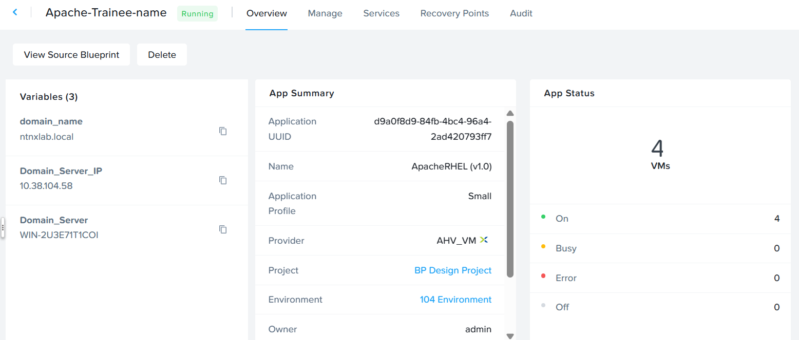

2.  Click on **ScaleOut**.

    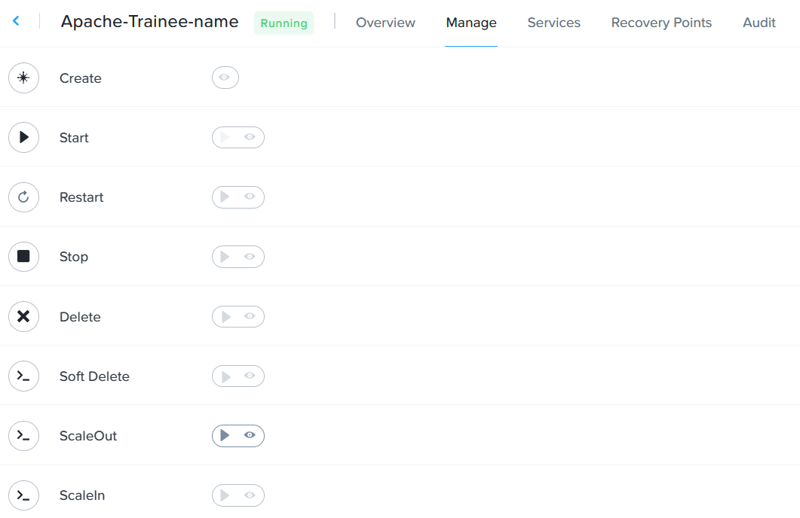

3.  Click on **Run**

    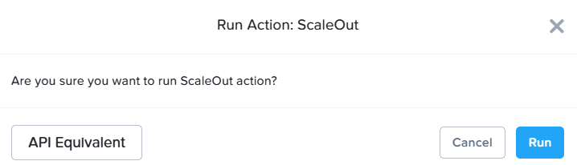

4.  Observe the audit.  It will take estimated 3 to 5 mins to complete the scale out.  Go for a coffee

    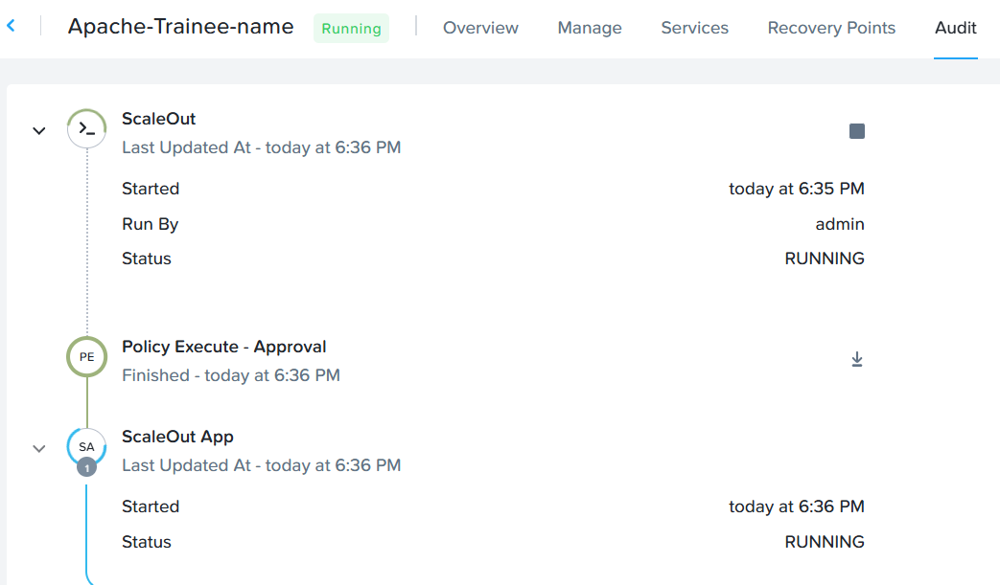

5.  Scale Out is completed

    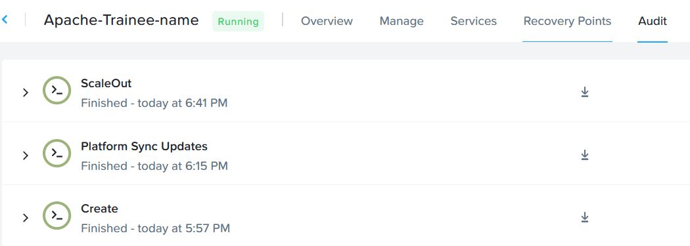

6.  Expand the audit log in **HA Proxy - Configure HAProxy**.  Observe the additional Apache web 
server is configured to the HAProxy

    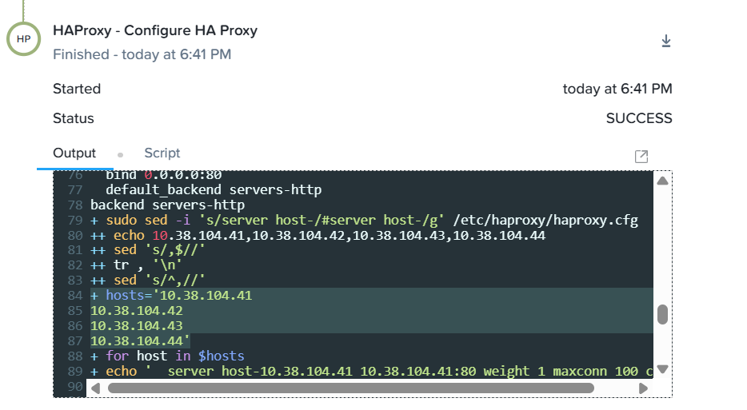

7.  Click on **Manage**.  Observe there are 4 Apache Web Server now

    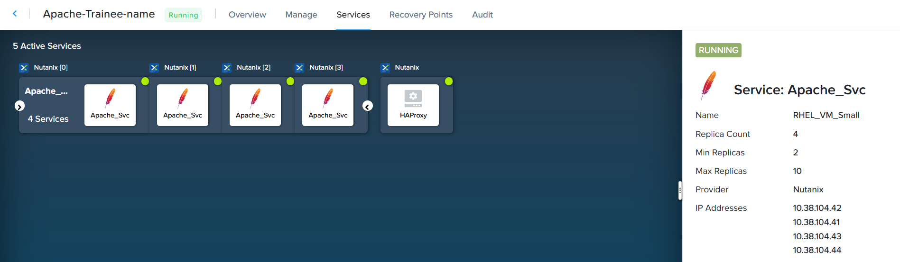

8.  Open a new browser window.  Put in the **HAProxy** IP address.  Observe the page as shown below

    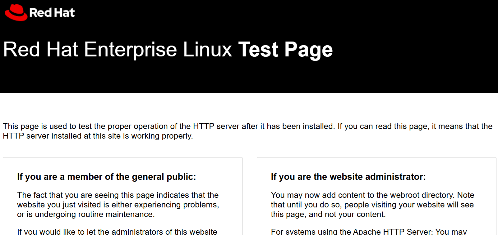

## Scale In the HAProxy Apache applications

1.  Click on **Manage**.  Click on **ScaleIn**

    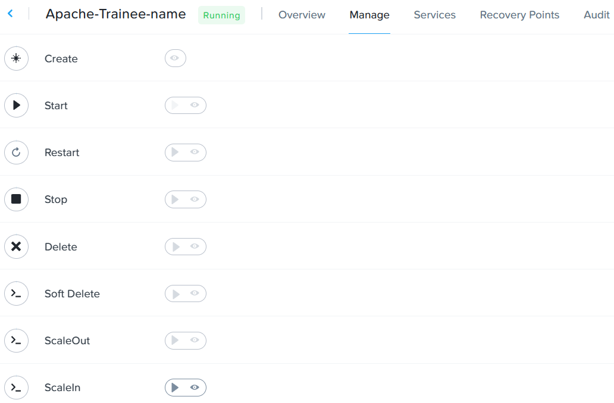

2.  Click on **Run**

    

3.  Scale In action is progressing.  Click on **Audit**

    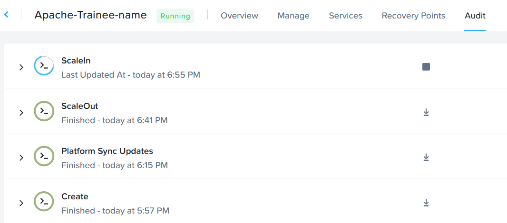

4.  Expand the audit.  Look for **HAProxy - Configure HA Proxy**.  Observe it has configured 3 Apache
Web Server hosts to the HAProxy.

    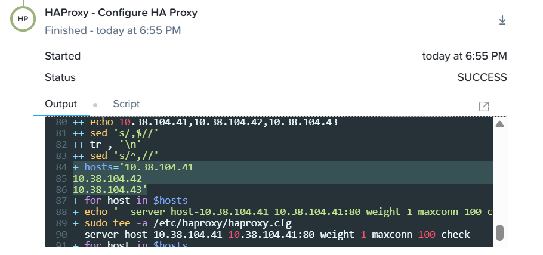

