# Product Configurations:

1.  NCM Self Service VM 4.2.0 on PC7.3
2.  Infrastructure cluster on AOS 7.3 on PC7.3

# Configure the Environment in Project

The environment play a critical role to allow the **Consumer** role user to launch a marketplace item with 
pre-defined hardware specification, guest customization and credentials required in the execution of the 
marketplace blueprint.

1.  Click on **Environments**

    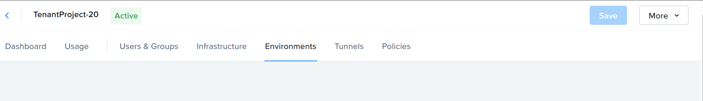

2.  Click on **Create Environment**

    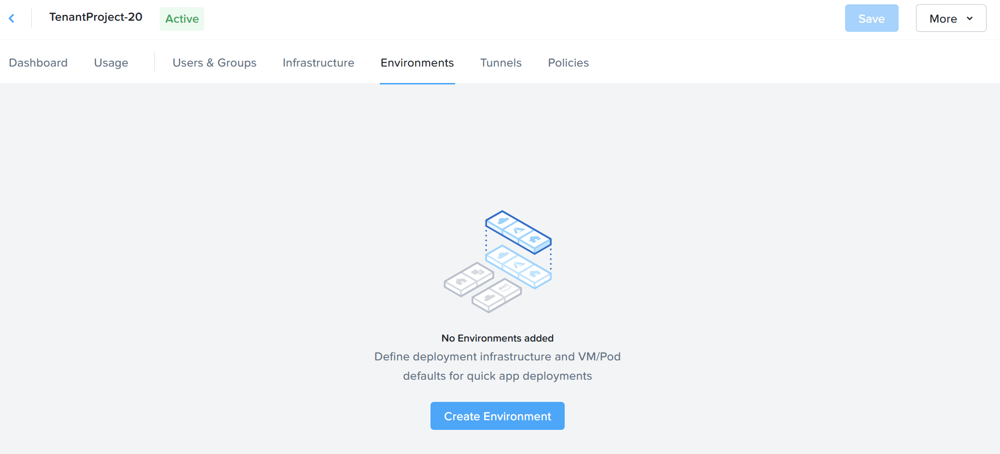

3.  Fill in the name for the environment. Eg **Tenantxx Environment**.  Replace xx with your trainee no.  

    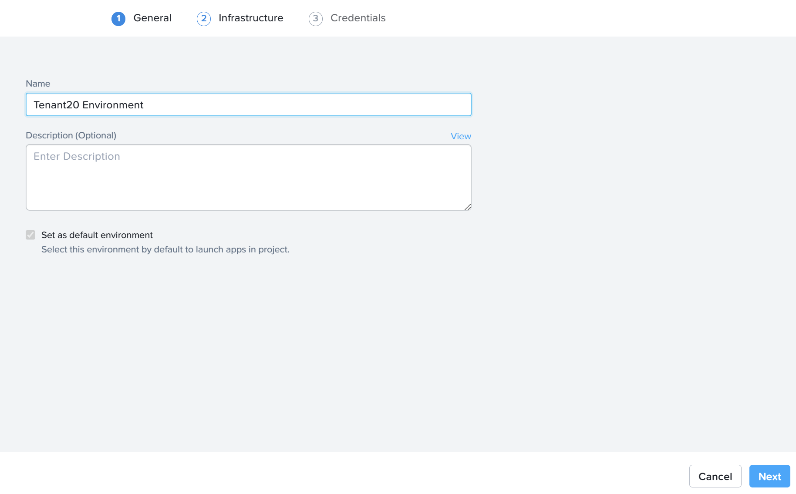

4.  Click on **Select Infrastructure**

    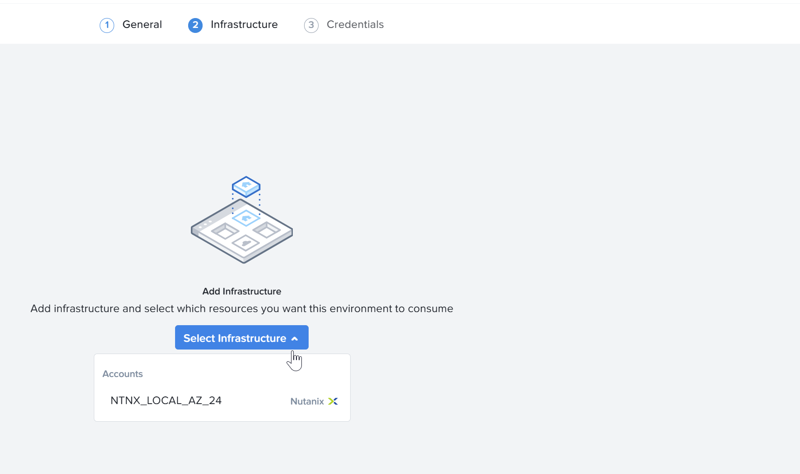
  
5.  Click on **Configure Resources**

    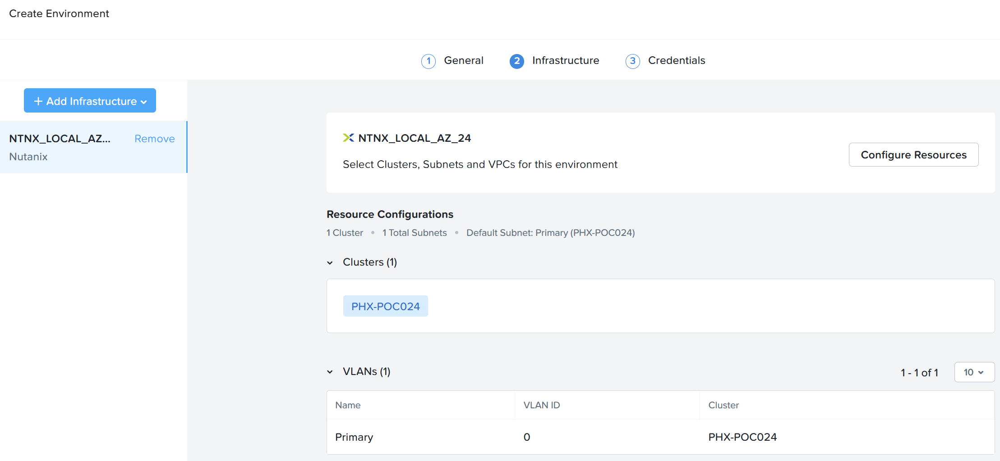

6.  Click on **Confirm**.  Click on **Confirm**

    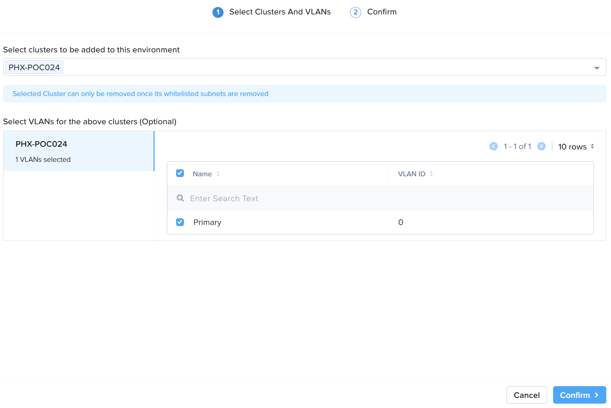

## Configure Marketplace Launch for Linux Marketplace Item

1.  Click on **Linux**. 

    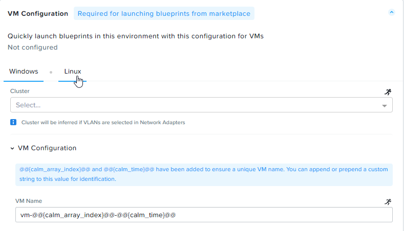

2.  Fill in the following hardware specification.

    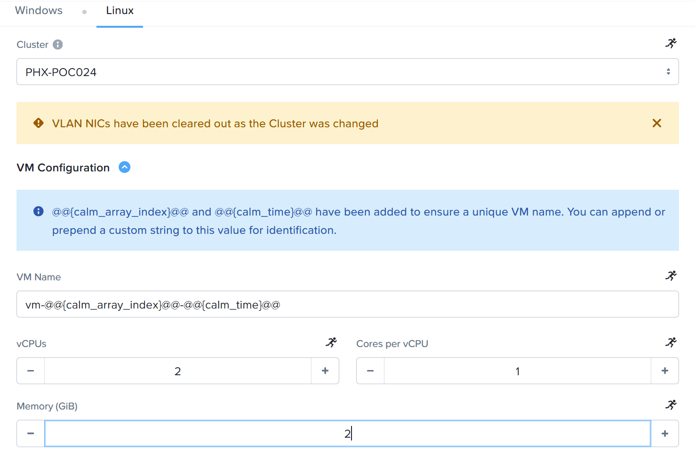

3.  Expand the **DISK** section. Select the disk image as shown.

    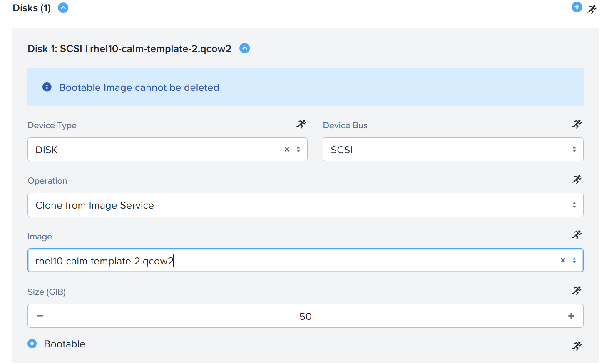
    
4.  Leave default for the following:

    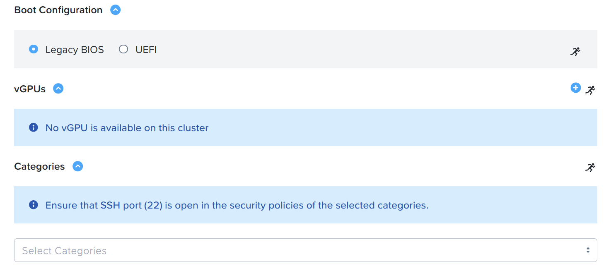

5.  Expand the **Network Adapter** section. Click on + icon.  Select the Network Adapter:
    **Primary**.

    

6.  Expand the **Connection** section. Click on **Add New Credential**.

    

### Create Credential used in Marketplace Launch for Linux Marketplace Items

1.  Create the credential for **RHEL**. Fill out the following fields:

    -   **Credential Name** - RHEL
    -   **Username** - nutanix
    -   **Secret Type** - ssh private key
    -   **Key** - 

   <Link href="https://www.dropbox.com/scl/fi/992k2b751ovmjvifo20mk/id_rsa?rlkey=brqmf3nrg7q8elrw8ecb3sw8h&dl=0" target="_blank" rel="noopener">Download to use the following private key:</Link>


    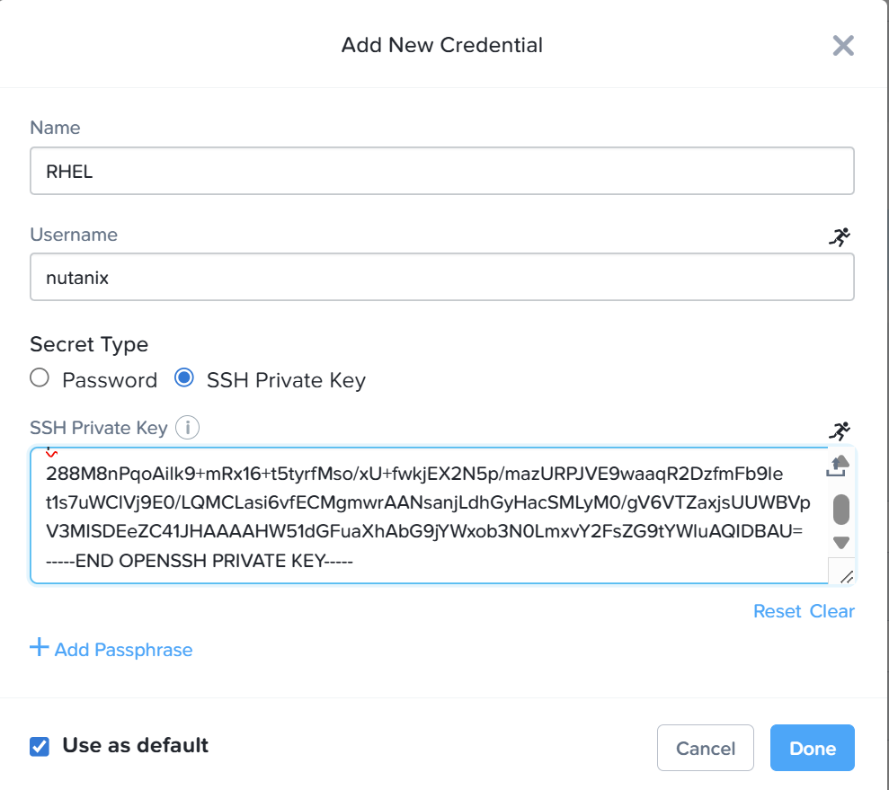

2.  Click on **Done**. Click on **Next**

3.  Click on **+ Add Credential**.  

    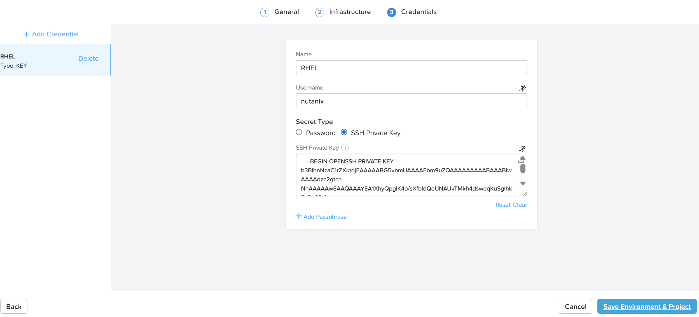

4.  Create the credential for **RHEL 2 Credential**. Fill out the following fields:

    -   **Credential Name** - RHEL 2 Credential
    -   **Username** - nutanix
    -   **Secret Type** - Password
    -   **Password** - Request from the trainer

5.  Click on **Done**. Click on **Next**

6.  Click on **+ Add Credential**.  

    

7.  Create the credential for **CalmVM Credential**. Fill out the following fields:

    -   **Credential Name** - CalmVM Credential
    -   **Username** - admin
    -   **Secret Type** - Password
    -   **Password** - Request from the trainer

8.  Click on **Save Environment**.

    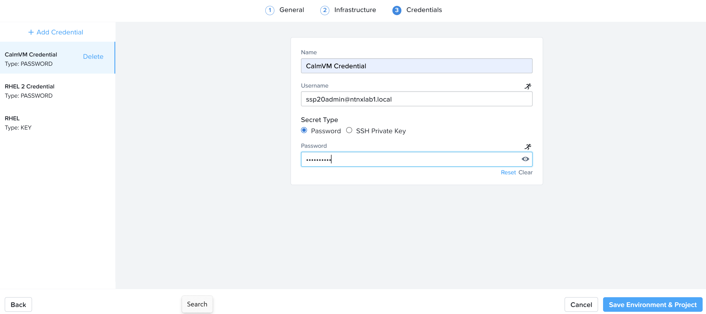

## Verify the Linux Environment

1.  Verify the environment was created. Click on **1 environment added**

    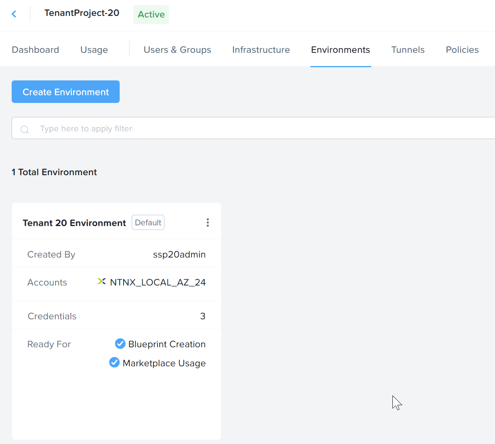

2.  Click on Update.

    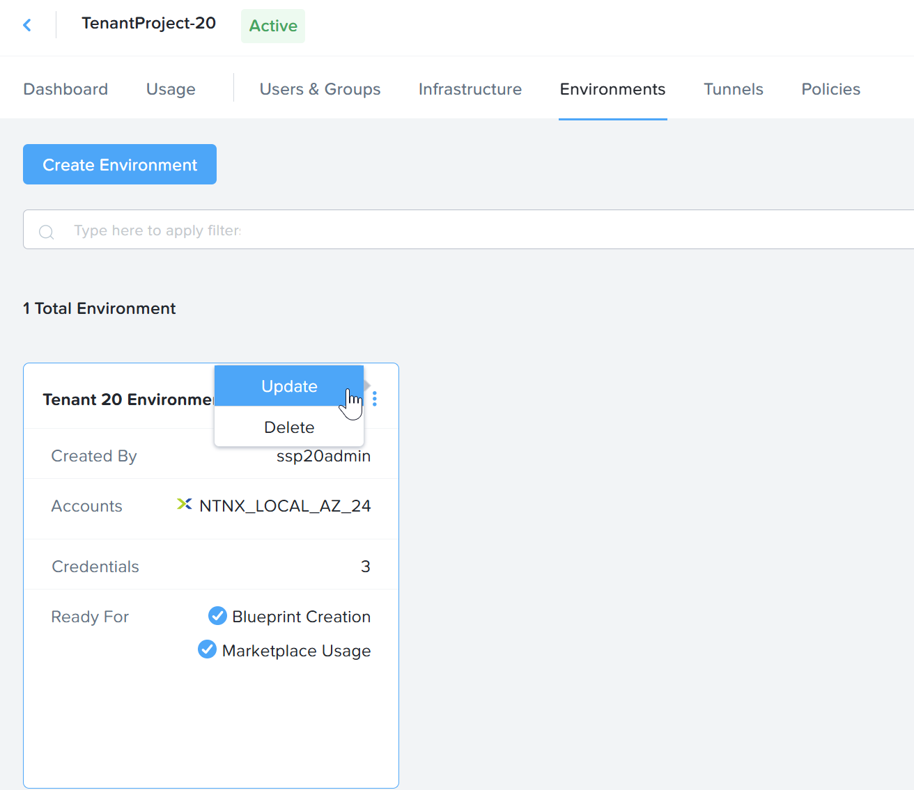

3.  Verify the **Ready for Marketplace usage, Linux only**

    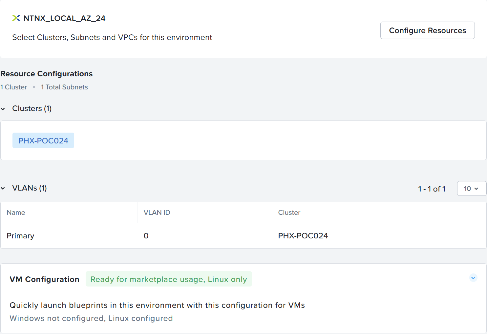

## Configure Marketplace Launch for Windows Marketplace Item

1.  Click on **Windows**

    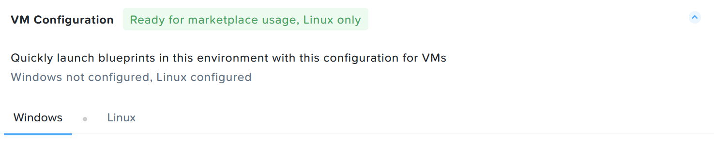

2.  Select the cluster.  Fill in the following hardware specification

    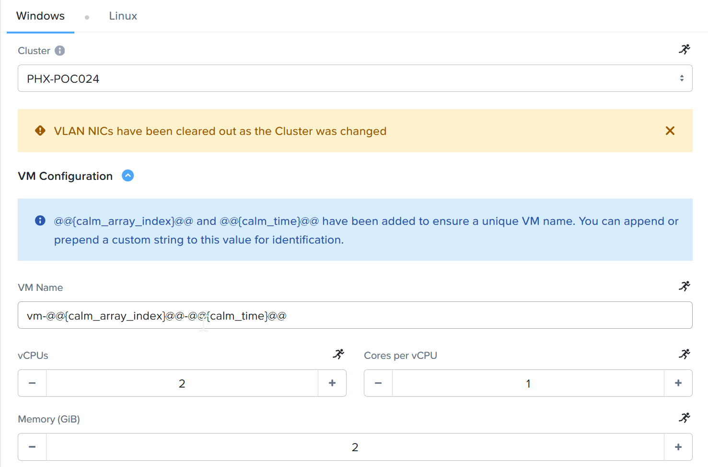

3.  Check on **Guest Customization**.

    ``` bash
    <?xml version="1.0" encoding="UTF-8"?>
    <unattend xmlns="urn:schemas-microsoft-com:unattend">
        <settings pass="specialize">
            <component xmlns:wcm="http://schemas.microsoft.com/WMIConfig/2002/State" xmlns:xsi="http://www.w3.org/2001/XMLSchema-instance" name="Microsoft-Windows-Shell-Setup" processorArchitecture="amd64" publicKeyToken="31bf3856ad364e35" language="neutral" versionScope="nonSxS">
                <ComputerName>@@{name}@@</ComputerName>
                <RegisteredOrganization>Nutanix</RegisteredOrganization>
                <RegisteredOwner>Acropolis</RegisteredOwner>
                <TimeZone>UTC</TimeZone>
            </component>
            <component xmlns="" name="Microsoft-Windows-TerminalServices-LocalSessionManager" publicKeyToken="31bf3856ad364e35" language="neutral" versionScope="nonSxS" processorArchitecture="amd64">
                <fDenyTSConnections>false</fDenyTSConnections>
            </component>
            <component xmlns="" name="Microsoft-Windows-TerminalServices-RDP-WinStationExtensions" publicKeyToken="31bf3856ad364e35" language="neutral" versionScope="nonSxS" processorArchitecture="amd64">
                <UserAuthentication>0</UserAuthentication>
            </component>
            <component xmlns:wcm="http://schemas.microsoft.com/WMIConfig/2002/State" xmlns:xsi="http://www.w3.org/2001/XMLSchema-instance" name="Networking-MPSSVC-Svc" processorArchitecture="amd64" publicKeyToken="31bf3856ad364e35" language="neutral" versionScope="nonSxS">
                <FirewallGroups>
                    <FirewallGroup wcm:action="add" wcm:keyValue="RemoteDesktop">
                        <Active>true</Active>
                        <Profile>all</Profile>
                        <Group>@FirewallAPI.dll,-28752</Group>
                    </FirewallGroup>
                </FirewallGroups>
            </component>
        </settings>
        <settings pass="oobeSystem">
            <component xmlns:wcm="http://schemas.microsoft.com/WMIConfig/2002/State" xmlns:xsi="http://www.w3.org/2001/XMLSchema-instance" name="Microsoft-Windows-Shell-Setup" processorArchitecture="amd64" publicKeyToken="31bf3856ad364e35" language="neutral" versionScope="nonSxS">
                <UserAccounts>
                    <AdministratorPassword>
                        <Value>@@{WIN_VM_CRED.secret}@@</Value>
                        <PlainText>true</PlainText>
                    </AdministratorPassword>
                </UserAccounts>
                <AutoLogon>
                    <Password>
                        <Value>@@{WIN_VM_CRED.secret}@@</Value>
                        <PlainText>true</PlainText>
                    </Password>
                    <Enabled>true</Enabled>
                    <Username>Administrator</Username>
                </AutoLogon>
                <FirstLogonCommands>
                    <SynchronousCommand wcm:action="add">
                        <CommandLine>cmd.exe /c netsh firewall add portopening TCP 5985 "Port 5985"</CommandLine>
                        <Description>Win RM port open</Description>
                        <Order>1</Order>
                        <RequiresUserInput>true</RequiresUserInput>
                    </SynchronousCommand>
                    <SynchronousCommand wcm:action="add">
                        <CommandLine>powershell -Command "Enable-PSRemoting -SkipNetworkProfileCheck -Force"</CommandLine>
                        <Description>Enable PS-Remoting</Description>
                        <Order>2</Order>
                        <RequiresUserInput>true</RequiresUserInput>
                    </SynchronousCommand>
                    <SynchronousCommand wcm:action="add">
                        <CommandLine>powershell -Command "Set-ExecutionPolicy -ExecutionPolicy RemoteSigned"</CommandLine>
                        <Description>Enable Remote-Signing</Description>
                        <Order>3</Order>
                        <RequiresUserInput>false</RequiresUserInput>
                    </SynchronousCommand>
                </FirstLogonCommands>
                <OOBE>
                    <HideEULAPage>true</HideEULAPage>
                    <SkipMachineOOBE>true</SkipMachineOOBE>
                </OOBE>
            </component>
            <component xmlns:wcm="http://schemas.microsoft.com/WMIConfig/2002/State" xmlns:xsi="http://www.w3.org/2001/XMLSchema-instance" name="Microsoft-Windows-International-Core" processorArchitecture="amd64" publicKeyToken="31bf3856ad364e35" language="neutral" versionScope="nonSxS">
                <InputLocale>en-US</InputLocale>
                <SystemLocale>en-US</SystemLocale>
                <UILanguageFallback>en-us</UILanguageFallback>
                <UILanguage>en-US</UILanguage>
                <UserLocale>en-US</UserLocale>
            </component>
        </settings>
    </unattend>
    ```
    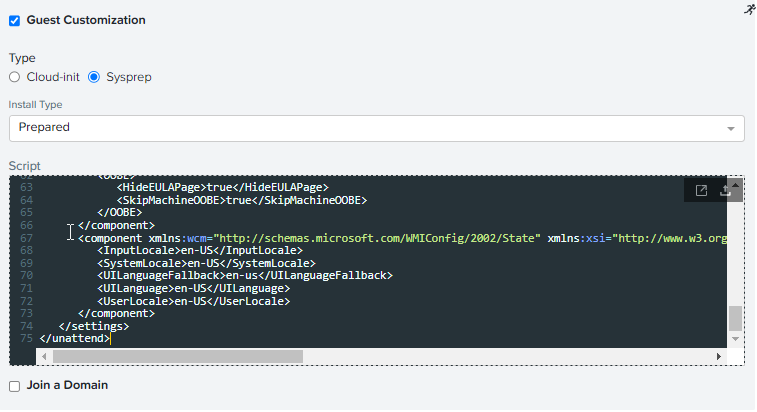

4.  Select the disk image.

    

5.  Select the network Adapter

    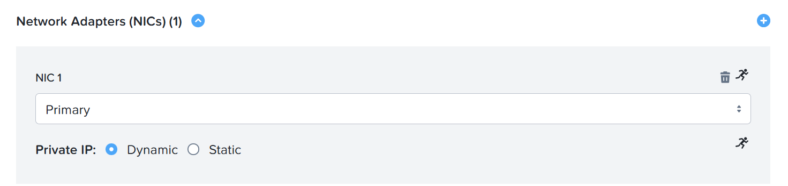

6.  Click on **Add Credential**

    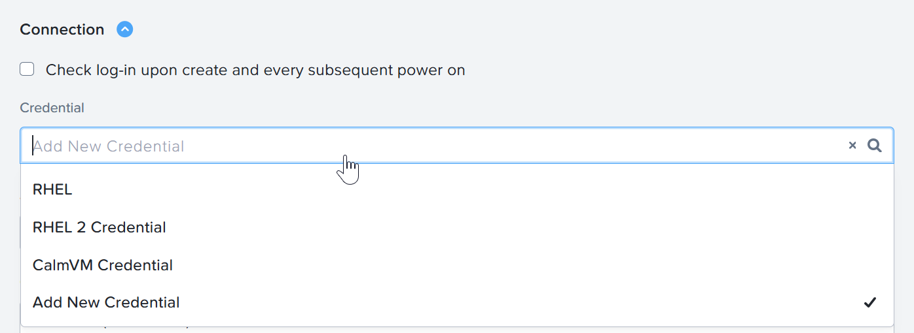

### Create Credential used in Marketplace Launch for Windows Marketplace Items

1.  Create the credential for **WIN_VM_CRED**. Fill in the following fields.  Click on **Done**

    -   **Credential Name** - WIN_VM_CRED
    -   **Username** - administrator
    -   **Secret Type** - password
    -   **Password** - Retrieve the password from the trainer

    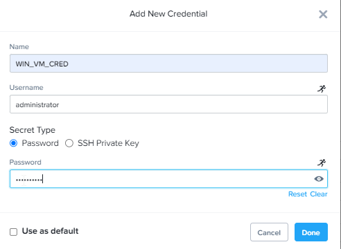

2.  Click on **Next**

    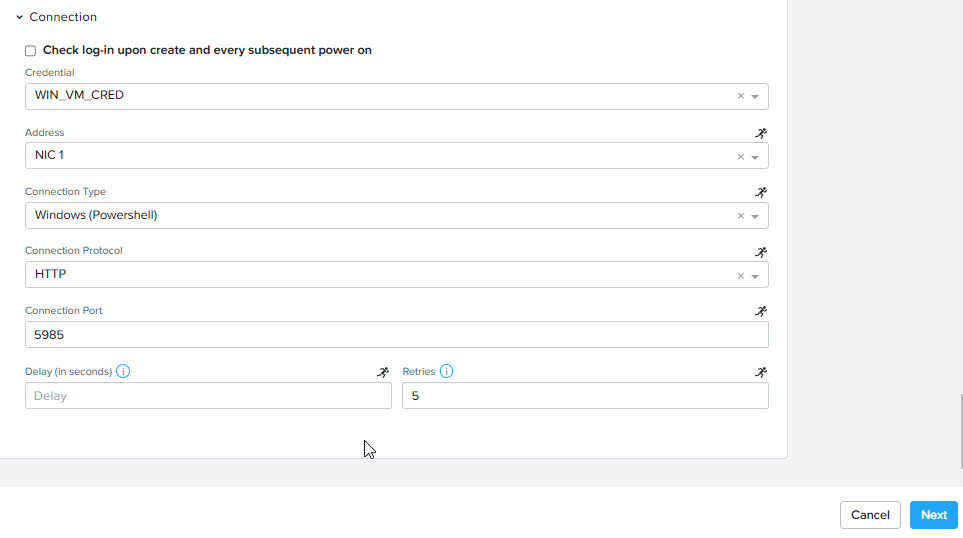

3.  Click on **+ Add Credential**

    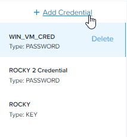

4.  Create the credential **DOMAIN_CRED** to store the credential for domain administrator

    -   **Credential Name** - DOMAIN_CRED
    -   **Username** - administrator@ntnxlab.local
    -   **Secret Type** - password
    -   **Password** - Retrieve the password from the trainer

    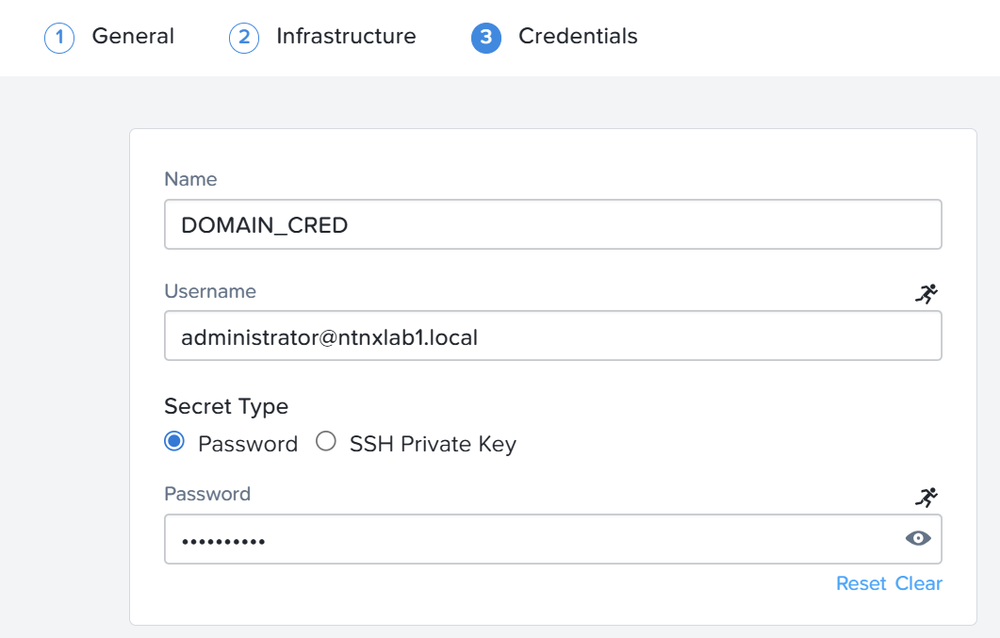

5.  Click on **+ Add Credential**

    

6.  Create the credential **USER_CRED** to store the credential for domain administrator

    -   **Credential Name** - USER_CRED
    -   **Username** - tenant
    -   **Secret Type** - password
    -   **Password** - Retrieve the password from the trainer

    

7.  Click on **Save Environment**

## Verify the Windows Environment

1. Click on **Update**

    

2. Click on **Next**

    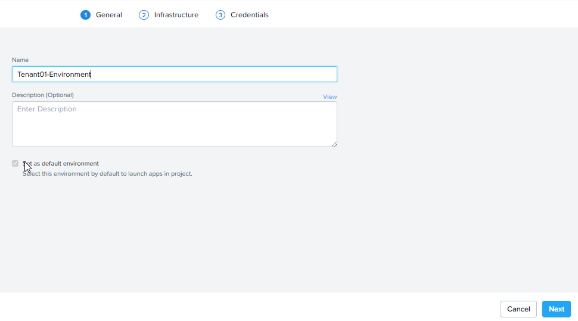

3.  Verify both **Windows and Linux configured**

    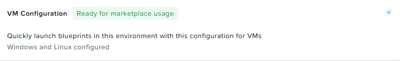
