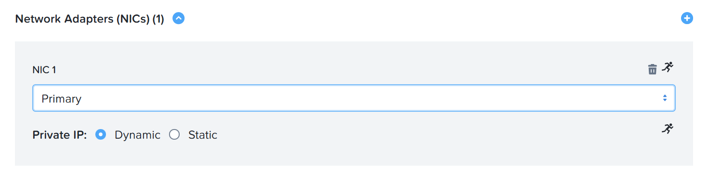
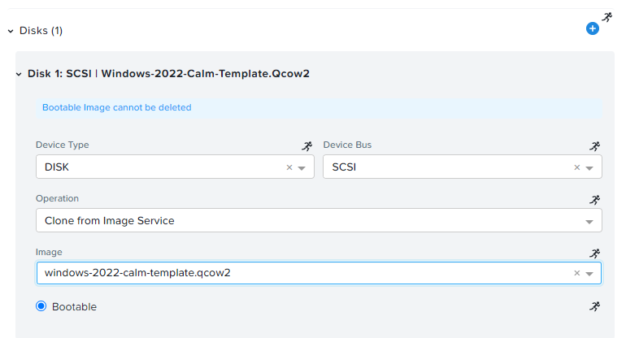
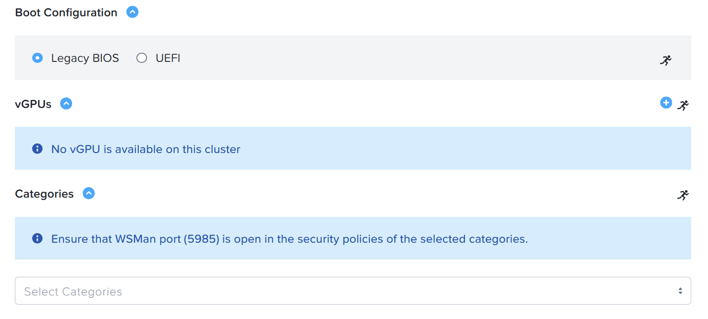
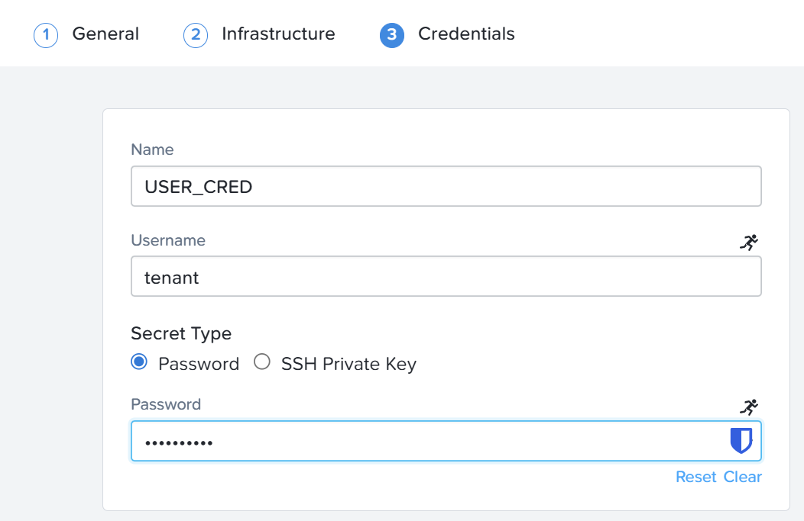
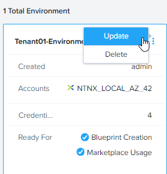

import Link from '@docusaurus/Link';

# Product Configurations:

1.  NCM Self Service VM 4.2.0 on PC7.3
2.  Infrastructure cluster on AOS 7.3 on PC7.3

# Purpose of Environment

The environment play a critical role to allow the **Consumer** role user to launch a marketplace item with 
pre-defined hardware specification, guest customization and credentials required in the execution of the 
marketplace blueprint.

It is quite common for every environment (DEV, SIT, UAT and Production) to have different credential.  
A single blueprint or marketplace item can be deployed to different environment substituting different
credentials NCM Self Service requires to automate in the enviroment.

# Configure the Environment in Project

1.  Click on **Environments**

    

2.  Click on **Create Environment**

    

3.  Fill in the name for the environment. Eg **Tenantxx Environment**.  Replace xx with your trainee no.  

    

4.  Click on **Select Infrastructure**

    
  
5.  Click on **Configure Resources**

    

6.  Click on **Confirm**.  Click on **Confirm**

    

## Configure Marketplace Launch for Linux Marketplace Item

1.  Click on **Linux**. 

    

2.  Fill in the following hardware specification.

    

3.  Expand the **DISK** section. Select the disk image as shown.

    
    
4.  Leave default for the following:

    

5.  Expand the **Network Adapter** section. Click on + icon.  Select the Network Adapter:
    **Primary**.

    

6.  Expand the **Connection** section. Click on **Add New Credential**.

    

### Create Credential used in Marketplace Launch for Linux Marketplace Items

1.  Create the credential for **RHEL**. Fill out the following fields:

    -   **Credential Name** - RHEL
    -   **Username** - nutanix
    -   **Secret Type** - ssh private key
    -   **Key** - 

   <Link href="https://www.dropbox.com/scl/fi/992k2b751ovmjvifo20mk/id_rsa?rlkey=brqmf3nrg7q8elrw8ecb3sw8h&dl=0" target="_blank" rel="noopener">Download to use the following private key:</Link>

    

2.  Click on **Done**. Click on **Next**

3.  Click on **+ Add Credential**.  

    

4.  Create the credential for **RHEL 2 Credential**. Fill out the following fields:

    -   **Credential Name** - RHEL 2 Credential
    -   **Username** - nutanix
    -   **Secret Type** - Password
    -   **Password** - Request from the trainer

5.  Click on **Done**. Click on **Next**

6.  Click on **+ Add Credential**.  

    

7.  Create the credential for **CalmVM Credential**. Fill out the following fields:

    -   **Credential Name** - CalmVM Credential
    -   **Username** - **Use SSP Admin username** Eg.  ssp20admin@ntnxlab1.local
    -   **Secret Type** - Password
    -   **Password** - Request from the trainer

8.  Click on **Save Environment**.

    

## Verify the Linux Environment

1.  Verify the environment was created. Click on **1 environment added**

    

2.  Click on Update.

    

3.  Verify the **Ready for Marketplace usage, Linux only**

    

## Configure Marketplace Launch for Windows Marketplace Item

1.  Click on **Windows**

    

2.  Select the cluster.  Fill in the following hardware specification

    

3.  Select the disk image.

    

4.  Use the default value

    

5.  Select the network Adapter.  Click on + sign to expand

    

6.  Click on **Add Credential**

    

### Create Credential used in Marketplace Launch for Windows Marketplace Items

1.  Create the credential for **WIN_VM_CRED**. Fill in the following fields.  Click on **Done**

    -   **Credential Name** - WIN_VM_CRED
    -   **Username** - administrator
    -   **Secret Type** - password
    -   **Password** - Retrieve the password from the trainer

    

2.  Click on **Next**

    

3.  Click on **+ Add Credential**

    

4.  Create the credential **DOMAIN_CRED** to store the credential for domain administrator

    -   **Credential Name** - DOMAIN_CRED
    -   **Username** - administrator@ntnxlab1.local
    -   **Secret Type** - password
    -   **Password** - Retrieve the password from the trainer

    

5.  Click on **+ Add Credential**

    

6.  Create the credential **USER_CRED** to store the credential for domain administrator

    -   **Credential Name** - USER_CRED
    -   **Username** - tenant
    -   **Secret Type** - password
    -   **Password** - Retrieve the password from the trainer

    

7.  Click on **Save Environment**

## Verify the Windows Environment

1. Click on **Update**

    

2. Click on **Next**

    

3.  Verify both **Windows and Linux configured**

    
