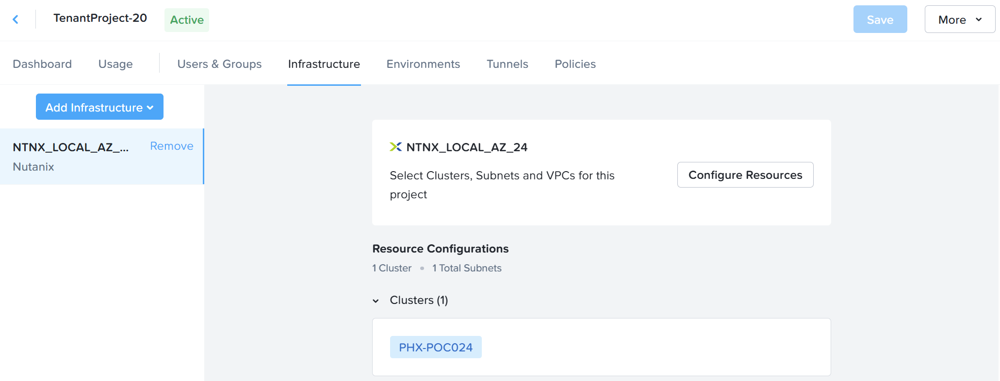

# Product Configurations:

1.  NCM Self Service VM 4.2.0 on PC7.3
2.  Infrastructure cluster on AOS 7.3 on PC7.3

# Add Infrastructure in Project

NCM Self Service has multiple infrastructure resources such as GPU clusters, High Performance All Flash clusters 
or General Purpose cluster in a typical production environment.  The purpose is to assign the infrastructure 
resources available to the tenant or project team.   The lab uses general purpose cluster.

1.  Click on **Infrastructure**.  

2. Click on **Add Infrastructure**. Select **NTNX_LOCAL_AZ_xx** as assigned by the trainer

    

3.  Click on **Configure Resources**. 

    

4.  Click on **Select Cluster**.  Click on **Select VLANs**

    

5.  Check on **Primary_xx** or **Secondary_xx** Network as assigned by the trainer.  

    

## No VPC in the cluster

1.  This section is for cluster not configured with VPC.  Please scroll down to **Configure VPC to the project** for cluster configured with VPC.

2.  Click **Confirm**

    

3.  Click **Confirm**

    

4.  Click **Save**   

    

5.  The project is in the **Active** state

    

## Configure VPC to the project 

1.  This section is for cluster configured with VPC.  **Please check with the trainer**

2.  Select **VPCs & Subnets**

    

3.  Select **VPC**. Select the Overlay Subnet **SG-AMK** Network. Click
    on **Confirm**.

    

4.  Select **Confirm**.

    

5.  Click on **Save**

    

