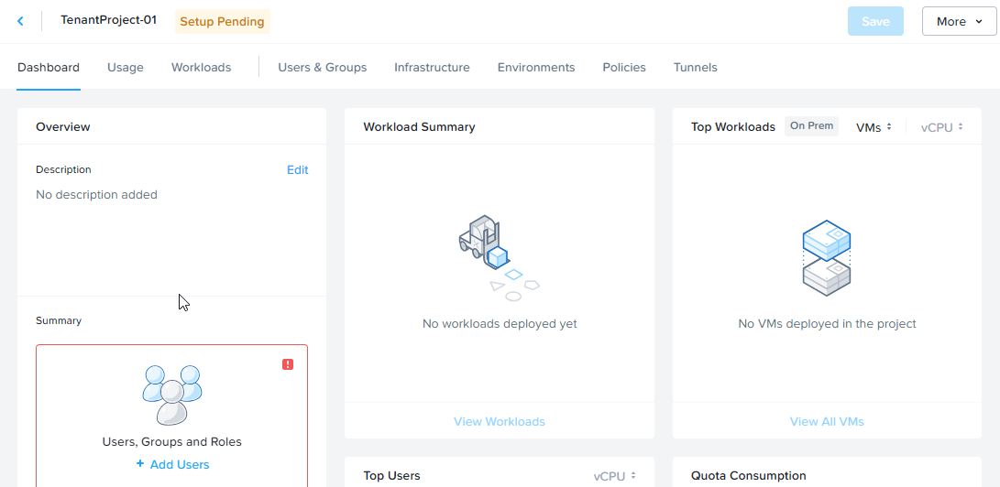

# Product Configurations:

1.  NCM Self Service VM 4.2.0 on PC7.3
2.  Infrastructure cluster on AOS 7.3 on PC7.3

## What is a Project

Project is the logical construct that allowed an administrator to assign both infrastructure resources and the roles/permissions of Active Directory users/groups to specific Blueprints and Applications.
Project also play cruical roles to segregate the infrastructure resources to different tenants or team

# Create a Project

1.  Login to the Self Service VM using the SSP Admin user provided in the Google spreadsheet.  An example is ssp20admin@ntnxlab1.local  

2.  Click on **Hamburger Menu**.  Select **Admin Center**

    

3.  Click on **Projects** 

    

4.  Click on **Create Project**.

    

5.  Fill in the Project Name. Eg TenantProject-TraineeNo. Click on
    **Create**.

    

6.  This project is in the **Pending** state.  

    

## Role Based Access in Project

Both configurations (NCM Self Service VM and NCM Self Service in Prism Central) leverages on the built in roles provided in Prism Central.  These are 
the specific role available for NCM Self Service

     

## Create user in Project

1.  Click on **Users and Groups**

    

2.  Click on **Add/Edit Users and Groups**

    

3.  Click on **+ Add User** 

    

4.  Fill in the following.  Replace **XYZ** with your trainee no

    - Name: tenant**XYZ**projadm
    - Role: Project Admin

    

5.  Add another user.  Replace **XYZ** with your trainee no

    - Name: tenant**XYZ**developer
    - Role: Consumer

    

6.  Add another user for the Blueprint Designer.  Replace **XYZ** with your trainee no

    - Name: tenant**XYZ**BPdeveloper
    - Role: Developer

    

7.  Click on **Save Users and Project**

