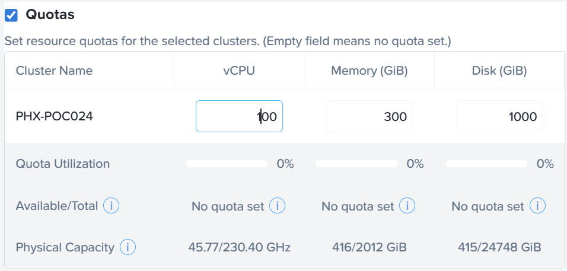
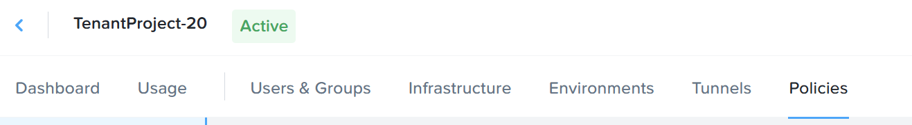
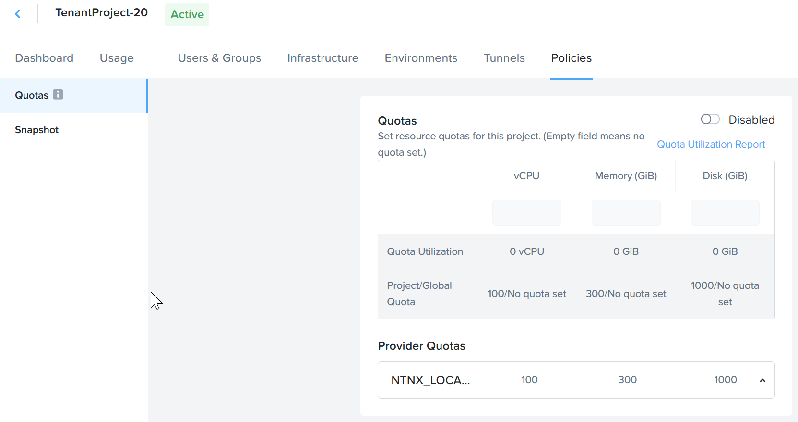

Nutanix provides 2 level of quota to provide granular control

1.  Account/Prism Central quota for this project
2.  Project level quota across multiple Account/Prism Central

## Configure Account/Prism Central Quota in Project

1.  Configure this section to configure the quota allocated to this project.

2.  Check the **Quotas**.  Fill in the following:

    - 100 vCPU
    - 300 GB Memory
    - 1000 GB Disk

    

3.  Click on **Save**

## Project level quota across multiple Account/Prism Central

1.  This feature is meaningful when the cloud infrastructure is huge and spread across multiple
availability zone or Prism Central.

2.  **This lab will not cover it due to lack of resource**.  

3.  Click on **Policies**

    

4.  Project Level quota across multiple Account/Prism Central

    

