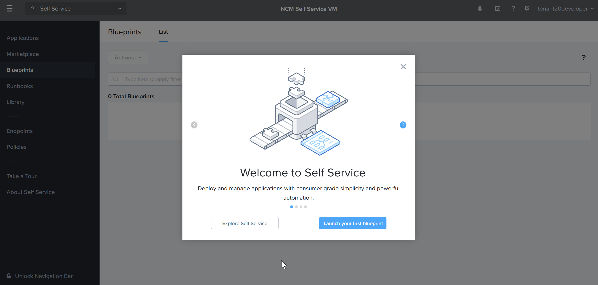
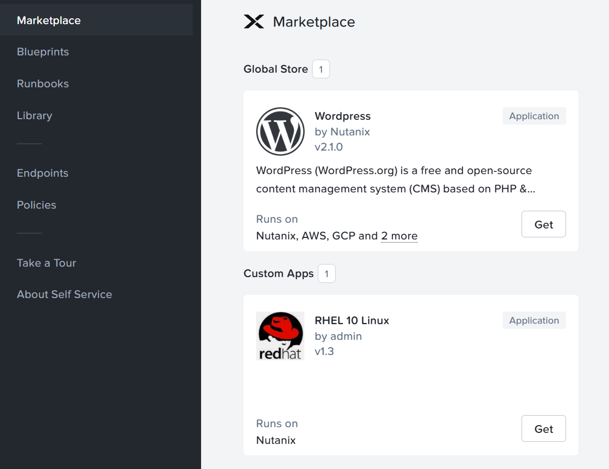
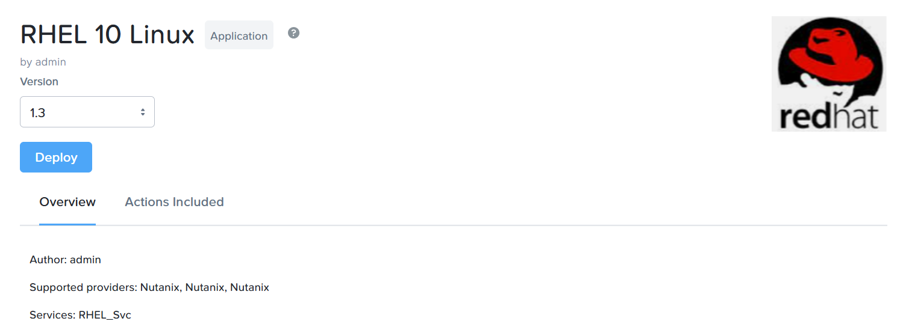
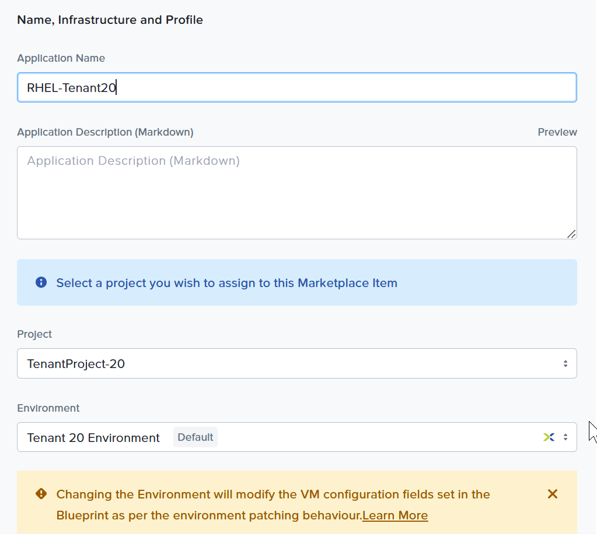
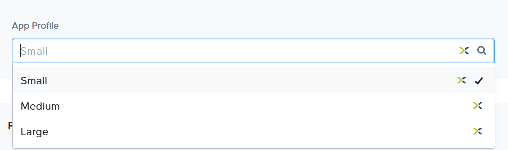
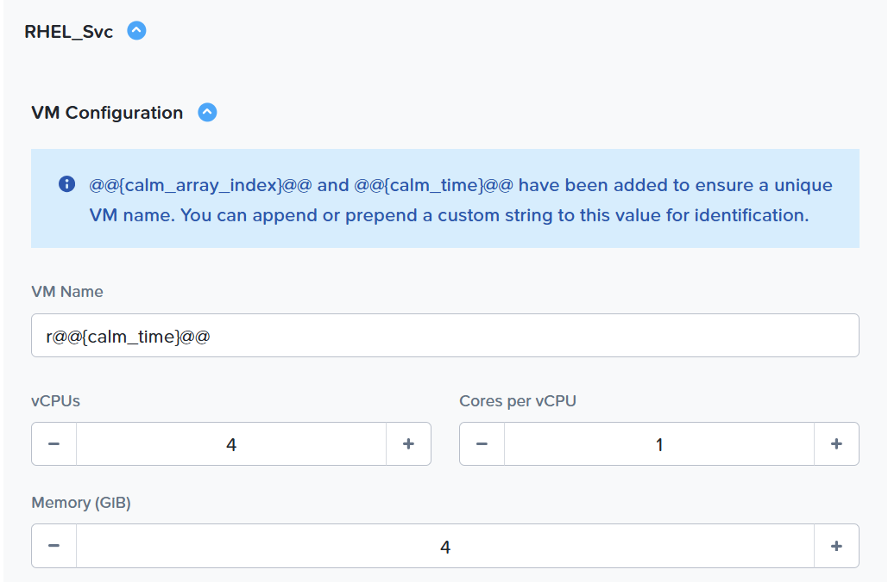
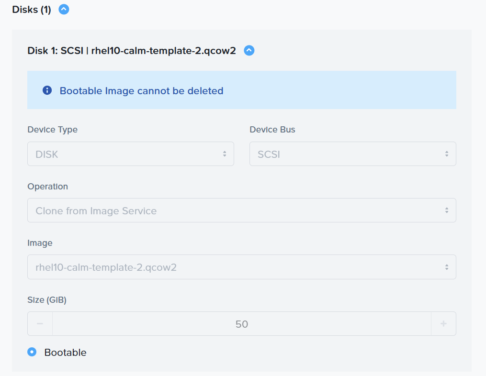
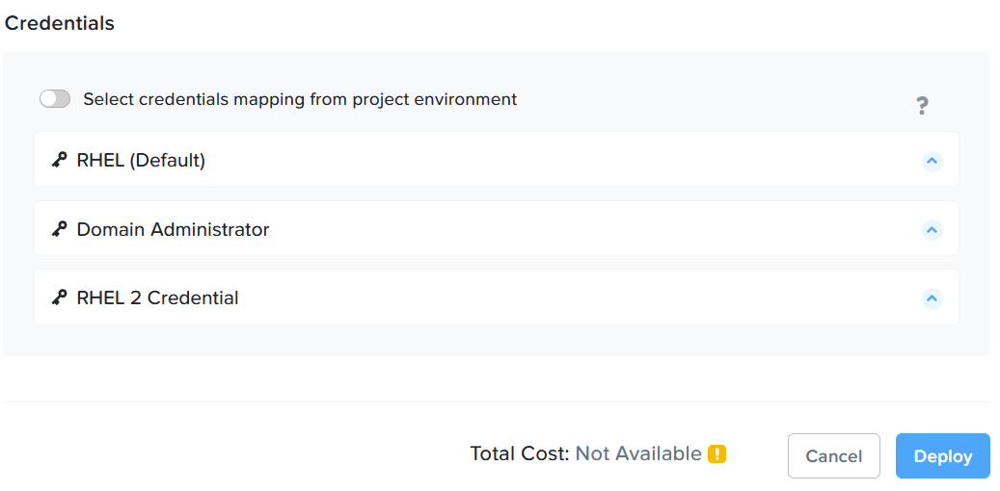
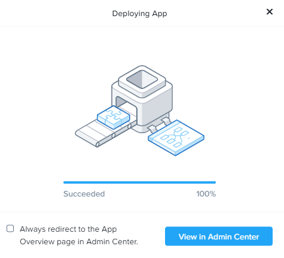
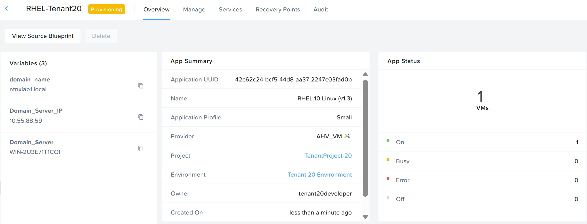

# Product Configurations:

1.  Calm VM 4.2.0 on PC7.3
2.  Infrastructure cluster on AOS 7.3 on PC7.3

# Overview

The objective is to illustrate a tenant developer requesting for resources like RedHat Linux from the 
market place.  The wordpress application is accesible by the members within the tenant project only.  It 
illustrates the RBAC of the project to restrict access.  The tenant does not have access to the 
Prism Central and access the VM through the **Open Terminal** only

# Consume RHEL Marketplace item

1.  Logout of Self Service VM.  Login as tenant**XYZ**developer@ntnxlab1.local user.  Replace XYZ with your assigned no in the Google spreadsheet.

2.  The tenant developer had login successfully

    

2.  Click on hamburger menu.  Click on **Self Service**

    

3.  Click on **Marketplace** on the left hand pane.

4.  Click on **Get** for **RHEL 10 Linux**.  

    

5.  Click on **Deploy**

    

6.  Fill in the following:

    - **Application Name:** RHEL-XYZ where XYZ is your assigned trainee no
    - **Project:** Select the project created earlier
    - **Environment:** Select the environment created earlier

   

7.  Click on the **Application Profile** for T shirt sizing.  Choose **Medium**

    

8.  Observe the VM sizing had changed.  Choose **Small** again to conserve resource.

    

9.  Observe the disk image is not editable to prevent tenant changing the version.

    

10.  NCM Self Service auto-patch the credential.  Explicit mapping is not necessary.  Click on **Deploy**

    

8.  Click on **View in Admin Center**

    

9.  The application is in the **Provisioning** state.  It will takes an estimated 5 minutes to 

    - Provision RHEL 10 VM
    - Install Software Package to join Active Directory Domain

10.  Click on **Audit**

    

13.  Wait till the application is in the **Running** state
