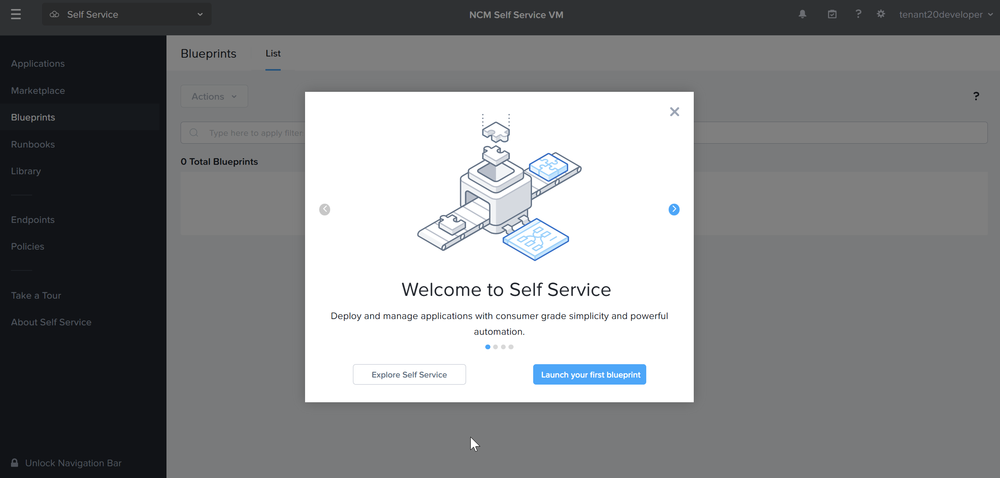
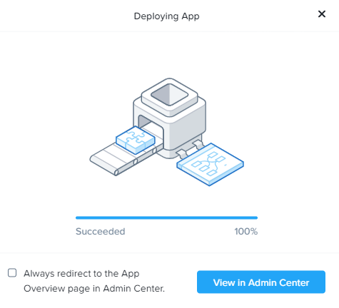

# Product Configurations:

1.  Calm VM 4.2.0 on PC7.3
2.  Infrastructure cluster on AOS 7.3 on PC7.3

# Consume Wordpress Marketplace item

1.  Logout of Self Service VM.  Login as tenant**XYZ**developer@ntnxlab1.local user.  Replace XYZ with your assigned no in the Google spreadsheet.

2.  The tenant developer had login successfully

    

2.  Click on hamburger menu.  Click on **Self Service**

    

3.  Click on **Marketplace** on the left hand pane.

4.  Both **Install AD and DNS** and **NKP** blueprints are not published to this project.  It is to
 illustrate it is possible to assign multiple marketplace Items to the project.  Click on **Get** 
 for **Wordpress**.  

    

5.  Click on **Deploy**

    

6.  Fill in the following:

    - **Application Name:** Wordpress-XYZ where XYZ is your assigned trainee no
    - **Project:** Select the project created earlier
    - **Environment:** Select the environment created earlier

   

7.  Scroll down.  Fill in the following.  Click on **Deploy**

    - **App Profile:** Nutanix
    - **WP_DB_PASSWORD:** Nutanix
    - **MYSQL_PASSWORD:** Nutanix

    

8.  Click on **View in Admin Center**

    

9.  The application is in the **Provisioning** state.  It will takes an estimated 5 to 10 minutes to 

    - Provision 1 HAProxy, 2 Apache Web Server & MySQL VM
    - Install the software in the respective VM

10.  Click on **Audit**

    

12.  Observe the audit to see the dependency in the startup.

    - MySQL service starts first.
    - Apache services starts next
    - HAProxy service start last

13.  Wait till the application is in the **Running** state

## Verification

1.  Click on **Services**

    

2.  Click on **HAProxy**

    

3.  Observe the service on the right side of the screen.  Click on **IP Address**

    

4.  Open a new browser tab.  Put in the **IP Address**

    

