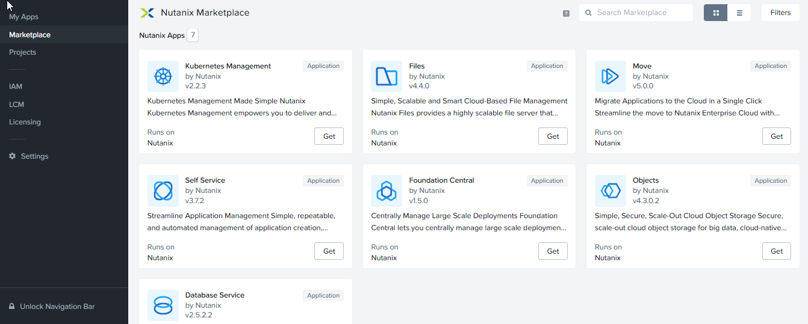
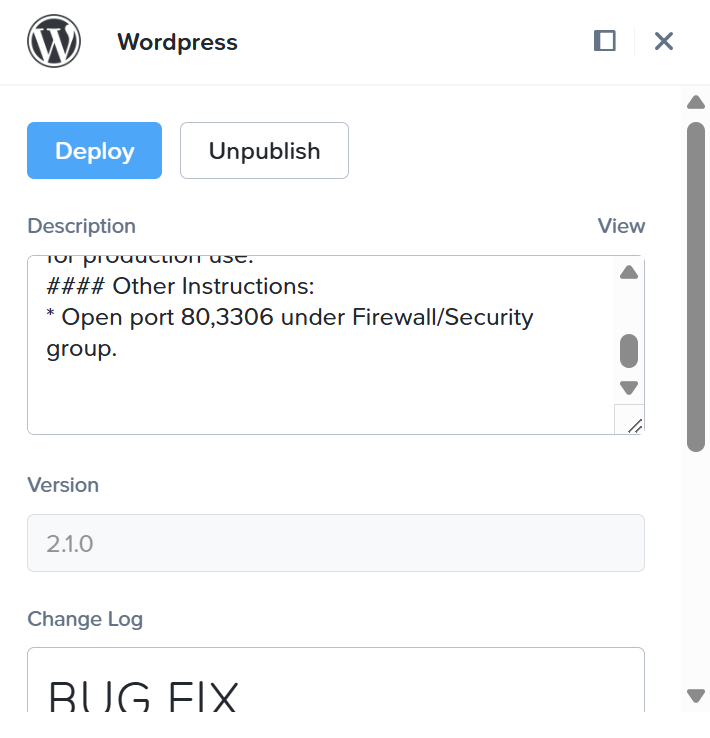

# Product Configurations:

1.  Calm VM 4.2.0 on PC7.3
2.  Infrastructure cluster on AOS 7.3 on PC7.3

# Overview

Nutanix Marketplace allows your developers and tenants to consume services across myraid clouds in an unified cloud
operating system.  Nutanix Marketplace allows you to congregate infrastructure providers like

- Nutanix AHV & ESXi 
- Nutanix Cloud Cluster on AWS and Azure 
- Nutanix Database
- VMware VCenter ESXi on 3 tiers 
- Native AWS
- Native Azure 
- Native GCP
- Kubernetes

The Marketplace allows the system administrator to consume native Nutanix Services.

    

You can provide the underlying infrastructure as services for the developers and tenants to consume.

- EC2 or VM as a service
- ECS or Container as a service
- EKS or Kubernetes as a service (Nutanix Kubernetes Platform, OpenShift, Rancher, Google Anthos, EKS Anywhere)
- EFS or File as a service
- S3 or Object as a service
- RDS or Database as a service
- VPC or Virtual Private Cloud as a service

  

