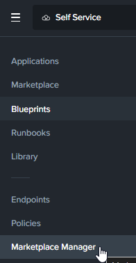

# Product Configurations:

1.  Calm VM 4.2.0 on PC7.3
2.  Infrastructure cluster on AOS 7.3 on PC7.3

# Publishing Blueprints from Marketplace Manager

By default, NCM Self Service comes pre-seeded with validated Blueprints for multiple open source and enterprise applications. Marketplace Manager acts as a
staging area for publishing default and user-created Blueprints to your local Marketplace. The Marketplace acts as an application store,
providing end users with a catalog of available applications.

**Approach the trainer to add your project to the Wordpress Marketplace Item**

1.  Login to Self Service VM as an sspadmin user.  Refer to the Google spreadsheet for the sspadmin user id.

2.  Click on hamburger menu.  Click on **Self Service**

    

3.  Click on **Marketplace Manager**

    

4. Filter by **Wordpress**

    

5.  Check on **wordpress**.  The detail popped up on the right.  Scroll down.

    

6.  Associate it with the project you had created earlier.  Click on **Apply**

    

7.  Click on **Publish**

    

