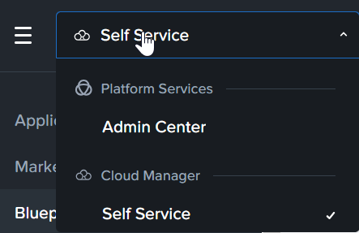
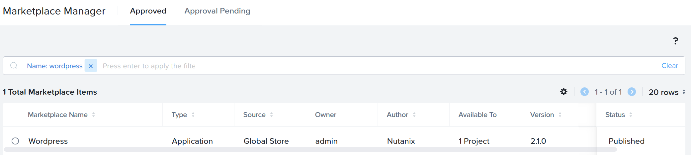

# Product Configurations:

1.  Calm VM 4.2.0 on PC7.3
2.  Infrastructure cluster on AOS 7.3 on PC7.3

# Publishing IaaS Blueprints from Marketplace Manager

The IaaS blueprint for both Windows Server 2022 and RedHat Enterprise Linux 10 are available.

1.  Login to Self Service VM as an sspadmin user.  Refer to the Google spreadsheet for the sspadmin user id.

2.  Click on hamburger menu.  Click on **Self Service**

    

3.  Click on **Marketplace Manager**

    

4. Filter by **rhel 10**

    

5.  Check on **rhel 10**.  The detail popped up on the right.  Scroll down.

    

6.  Associate the latest version (1.3) with the project you had created earlier.  

    

7.  Click on **Apply**

    

