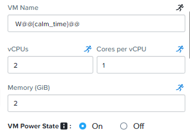
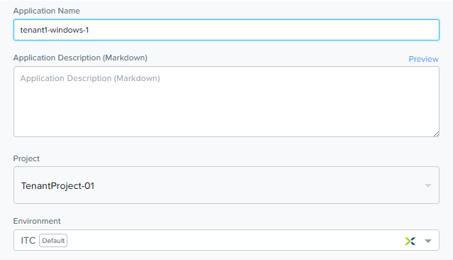
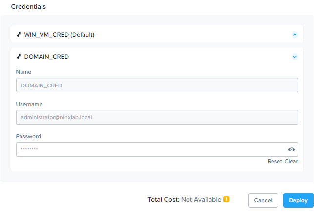
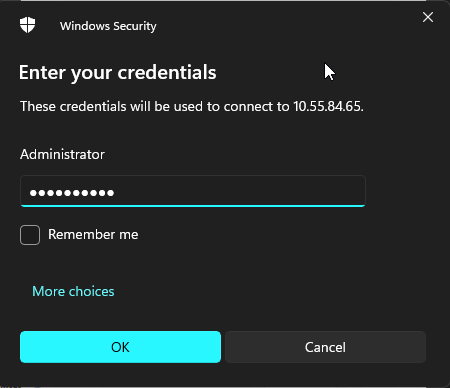
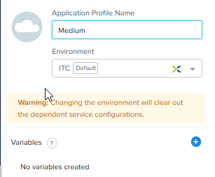

# Product Configurations:

1.  Calm VM 3.8.0 on PC2024.1
2.  Infrastructure cluster on AOS 6.8.0.5 on PC2024.1.01

# Overview

:::info

Estimated time to complete: **90 minutes**

In this exercise you will create a NCM Self Service Blueprint with T-Shirt sizing (Small, Medium, Large) to 
provision the VM in a VLAN network.  

The image (Windows Server 2022) will be sysprepped with an unattended XML answer file, and then will be added 
to a Domain using Powershell script.  We'll also add a script to remove the computer from the Domain upon deletion.

:::

# Creating Blueprint

1.  Login using the Blueprint Designer.

    

2.  Click on hamburger menu.  Select **Self Service**

    

2.  Click on **Blueprints** from the sidebar and click **+ Create Blueprint**, choose **Multi VM Blueprint**.

    

3.  Key in the following:
    -  **Name:** Tenant**XYZ**_Windows_AD  Replace XYZ with your assigned trainee no
    -  **Description:** **Windows 2022 added to AD** 
    -  **Project:** Select the project created earlier

     

4.  Click **Proceed**

# Configure Credential in the Blueprint

Credential is used to abstract the credential in the automation script.  Do you remember creating the credential in
the environment earlier?  The crednential in environment allows dynamic substituition of credential to 
specific environment in the marketplace launch.  An example is

    - The password to connect to the dev database is **dev123** in Development Environment - 
    - The password to connect to the sit database is **sit123** in System Integration Environment
   

1.  Click **Credentials>** in the top middle of the screen.

    

2.  Click on > ``+`` sign to create the **WIN_VM_CRED** credentials:

    -   **Credential Name** - WIN_VM_CRED
    -   **Username** - Administrator
    -   **Secret** - Password
    -   **Password** - Get the password from the trainer.  **Check the running man to allow changing of password during launch**

    

3.  Click on > ``+`` sign to create the **DOMAIN_CRED** credentials to store the credential to the Active Directory

    -   **Credential Name** - DOMAIN_CRED
    -   **Username** - Administrator
    -   **Secret** - Password
    -   **Password** - Get the password from the trainer.  **Check the running man to allow changing of password during launch**

    

4.  Click on **Save** on the top right of the screen

    

5.  Click on **Back**.

# Application Profile

The purpose of the application profile is to allow the Blueprint Designer to configure T-Shirt sizing 
(Small, Medium or Large) or different cloud provider (Nutanix, VMware, AWS, Azure or GCP).

1.  On the left side of the screen, click on **Application Profile**.  Click on **Default**

    

2.  On the right side of the screen, change from **Default** to **Small**

    

## Setting Variables for the **Small** Application Profile

Variables improve the extensibility of Blueprints. For this Blueprint, we'll want to define the domain name that the Windows VM will join to,
and the IP of the Active Directory server. We'll leave the **Secret** variables **un-checked**.

1.  On the right side of the screen, in the **Configuration Pane** under **Variable List**, fill out the following fields:

    | Variable Name       | Value | 
    | ------------------------ | :------------------------------------: | 
    | DOMAIN_NAME            |   ntnxlab.local | 
    | AD                   |     Get the IP address from the trainer | 

2.  Click **+** to add an variable for **DOMAIN_NAME**.  Check the running man

    

3.  Repeat for variable **AD**

4.  This is a screenshot for the 2 variables created

   

5.  Click **Save** on the top right of the screen

# Adding Windows Service

:::note
 
**Service1** appears in the **Workspace** and the **Configuration Pane** reflects the configuration of the selected service.

:::

1.  On the left side of the screen, click on **+**

    

2.  Notice a VM is created in the blueprint canvas

    

3. Fill out the following fields on the right side:

   -   **Service Name** - Windows
   -   **Name** - Windows_AD
   -   **Account** - Choose the account provider assigned to you
   -   **OS** - Windows
   -   **Cluster** - Choose the cluster

    

4.  Scroll down.  Fill out the following fields:

   -   **VM Name** - ``W@@{calm_time}@@``
   -   **vCPU** - 2 - Check the running man
   -   **Cores Per CPU** - 1 - Check the running man
   -   **Memory** - 2 - Check the running man
   -   **VM Power State** - On

    

5.  Scroll down.  Check the **Guest Customization**

    - **Type** - Sysprep
    - **Install Type** - Prepared
    - **Script** - Paste the sysprep script

    

 6.  Paste the sysprep script    
    
    :::note

    This Unattended XML answer file will set some basic computer information such as hostname and organization, configure the Administrator password to our WIN_VM_CRED secret, open Powershell port 5985 in the firewall, and enable remote Powershell functionality.
    
    :::

    ``` xml
    <?xml version="1.0" encoding="UTF-8"?>
    <unattend xmlns="urn:schemas-microsoft-com:unattend">
        <settings pass="specialize">
            <component xmlns:wcm="http://schemas.microsoft.com/WMIConfig/2002/State" xmlns:xsi="http://www.w3.org/2001/XMLSchema-instance" name="Microsoft-Windows-Shell-Setup" processorArchitecture="amd64" publicKeyToken="31bf3856ad364e35" language="neutral" versionScope="nonSxS">
                <ComputerName>@@{name}@@</ComputerName>
                <RegisteredOrganization>Nutanix</RegisteredOrganization>
                <RegisteredOwner>Acropolis</RegisteredOwner>
                <TimeZone>UTC</TimeZone>
            </component>
            <component xmlns="" name="Microsoft-Windows-TerminalServices-LocalSessionManager" publicKeyToken="31bf3856ad364e35" language="neutral" versionScope="nonSxS" processorArchitecture="amd64">
                <fDenyTSConnections>false</fDenyTSConnections>
            </component>
            <component xmlns="" name="Microsoft-Windows-TerminalServices-RDP-WinStationExtensions" publicKeyToken="31bf3856ad364e35" language="neutral" versionScope="nonSxS" processorArchitecture="amd64">
                <UserAuthentication>0</UserAuthentication>
            </component>
            <component xmlns:wcm="http://schemas.microsoft.com/WMIConfig/2002/State" xmlns:xsi="http://www.w3.org/2001/XMLSchema-instance" name="Networking-MPSSVC-Svc" processorArchitecture="amd64" publicKeyToken="31bf3856ad364e35" language="neutral" versionScope="nonSxS">
                <FirewallGroups>
                    <FirewallGroup wcm:action="add" wcm:keyValue="RemoteDesktop">
                        <Active>true</Active>
                        <Profile>all</Profile>
                        <Group>@FirewallAPI.dll,-28752</Group>
                    </FirewallGroup>
                </FirewallGroups>
            </component>
        </settings>
        <settings pass="oobeSystem">
            <component xmlns:wcm="http://schemas.microsoft.com/WMIConfig/2002/State" xmlns:xsi="http://www.w3.org/2001/XMLSchema-instance" name="Microsoft-Windows-Shell-Setup" processorArchitecture="amd64" publicKeyToken="31bf3856ad364e35" language="neutral" versionScope="nonSxS">
                <UserAccounts>
                    <AdministratorPassword>
                        <Value>@@{WIN_VM_CRED.secret}@@</Value>
                        <PlainText>true</PlainText>
                    </AdministratorPassword>
                </UserAccounts>
                <AutoLogon>
                    <Password>
                        <Value>@@{WIN_VM_CRED.secret}@@</Value>
                        <PlainText>true</PlainText>
                    </Password>
                    <Enabled>true</Enabled>
                    <Username>Administrator</Username>
                </AutoLogon>
                <FirstLogonCommands>
                    <SynchronousCommand wcm:action="add">
                        <CommandLine>cmd.exe /c netsh firewall add portopening TCP 5985 "Port 5985"</CommandLine>
                        <Description>Win RM port open</Description>
                        <Order>1</Order>
                        <RequiresUserInput>true</RequiresUserInput>
                    </SynchronousCommand>
                    <SynchronousCommand wcm:action="add">
                        <CommandLine>powershell -Command "Enable-PSRemoting -SkipNetworkProfileCheck -Force"</CommandLine>
                        <Description>Enable PS-Remoting</Description>
                        <Order>2</Order>
                        <RequiresUserInput>true</RequiresUserInput>
                    </SynchronousCommand>
                    <SynchronousCommand wcm:action="add">
                        <CommandLine>powershell -Command "Set-ExecutionPolicy -ExecutionPolicy RemoteSigned"</CommandLine>
                        <Description>Enable Remote-Signing</Description>
                        <Order>3</Order>
                        <RequiresUserInput>false</RequiresUserInput>
                    </SynchronousCommand>
                </FirstLogonCommands>
                <OOBE>
                    <HideEULAPage>true</HideEULAPage>
                    <SkipMachineOOBE>true</SkipMachineOOBE>
                </OOBE>
            </component>
            <component xmlns:wcm="http://schemas.microsoft.com/WMIConfig/2002/State" xmlns:xsi="http://www.w3.org/2001/XMLSchema-instance" name="Microsoft-Windows-International-Core" processorArchitecture="amd64" publicKeyToken="31bf3856ad364e35" language="neutral" versionScope="nonSxS">
                <InputLocale>en-US</InputLocale>
                <SystemLocale>en-US</SystemLocale>
                <UILanguageFallback>en-us</UILanguageFallback>
                <UILanguage>en-US</UILanguage>
                <UserLocale>en-US</UserLocale>
            </component>
        </settings>
    </unattend>
    ```
6.  Scroll down.  Select the following:

   -   **Device Type** - Disk
   -   **Device Bus** - SCSI
   -   **Operation** - Clone from Image Service
   -   **Image** - windows-server-2022-calm-template-qcow2
   -   **Boot Configuration** - Legacy BIOS

    

7.  Scroll down.  Select ``+`` sign on **Network Adapters (NICs)**

    -   **NIC 1** - Primary_xxx
    -   **Private IP**: Dynamic

     

8.  Scroll down.  Select **WIN_VM_CRED** and leave the rest of the field as default

    

4.  Click **Save** and ensure no errors or warnings pop-up. If they do,
    resolve the issue, and **Save** again.

## Create action to join Active Directory Domain

1. The purpose of action is create a set of re-usable tasks across different packages in different application 
profiles.

2.  Click on the **+** on the left side of the screen

    

3.  Fill in the action name on the right side of the screen.  Click on the **+ Task** button.

    

4.  Fill in the following fields on the **Configuration Panel** on the right:

   -  **Name Task** - Set Host Name
   -  **Type** - Execute
   -  **Script Type** - Powershell
   -  **Endpoint** - Leave it empty
   -  **Credential** - WIN_VM_CRED

    

5.  Copy and Paste it in the script section.

    :::note

    Looking at the script you can see a function that sets the VM's hostname if it is not already set, a function that joins the computer to the domain specified via our macro and credentials that we set earlier, and finally restarts the user VM so the domain join takes affect.

    :::

    ```powershell
    $HOSTNAME = "@@{name}@@"

    function Set-Hostname{
        [CmdletBinding()]
        Param(
            [parameter(Mandatory=$true)]
            [string]$Hostname
        )
        if ($Hostname -eq  $(hostname)){
            Write-Host "Hostname already set."
        } else{
            Rename-Computer -NewName $HOSTNAME -ErrorAction Stop
        }
    }

    if ($HOSTNAME -ne $Null){
        Write-Host "Setting Hostname"
        Set-Hostname -Hostname $HOSTNAME
    }

    exit 0
    ```

6.  Add an action to restart the VM.  Click on **+ Action**

    

7.  Fill in the following:

    -  **Name Action** - Restart the VM
    -  **Service/VM action** - Restart

     

8.  Fill in the following fields on the **Configuration Panel** on the right:

   -   **Name Task** - Join AD Domain
   -   **Type** - Execute
   -   **Script Type** - Powershell
   -   **Endpoint** - Leave it empty
   -   **Credential** - WIN_VM_CRED

    

 8.  Copy and paste the following script into the **Script** field:

    ```powershell
    function JointoDomain {
        [CmdletBinding()]
        Param(
            [parameter(Mandatory=$true)]
            [string]$DomainName,
            [parameter(Mandatory=$false)]
            [string]$OU,
            [parameter(Mandatory=$true)]
            [string]$Username,
            [parameter(Mandatory=$true)]
            [string]$Password,
            [parameter(Mandatory=$true)]
            [string]$Server
        )
        $adapter = Get-NetAdapter | ? {$_.Status -eq "up"}
        $adapter | Set-DnsClientServerAddress -ServerAddresses $Server

        if ($env:computername  -eq $env:userdomain) {
            Write-Host "Not in domain"
            $adminname = "$DomainName\$Username"
            $adminpassword = ConvertTo-SecureString -asPlainText -Force -String "$Password"
            Write-Host "$adminname , $password"
            $credential = New-Object System.Management.Automation.PSCredential($adminname,$adminpassword)
            Add-computer -DomainName $DomainName -Credential $credential -force -Options JoinWithNewName,AccountCreate -PassThru -ErrorAction Stop
        } else {
            Write-Host "Already in domain"
        }
    }

    JointoDomain -DomainName "@@{DOMAIN_NAME}@@" -Username "@@{DOMAIN_CRED.username}@@" -Password "@@{DOMAIN_CRED.secret}@@" -Server "@@{AD}@@"
    ```

## Join **Join AD Domain** Action to Package Install

1.  Expand on **Package**.  Click on **Install**.  Click on **+ Action**

    

2.  Fill in the following:

    - **Task Name** Join AD Domain
    - **Service/VM action** Join AD Domain

    

## Create an action to **Unjoin AD Domain**

1.  Click on **+** to add a service action

    

2.  Fill in the action name: **Unjoin AD Domain**

    

3.  Click on **+ Task**

    - **Task Name:** Unjoin AD Domain
    - **Type:** Execute
    - **Script Type:** Powershell
    - **Endpoint:** Leave it empty
    - **Credential:** WIN_VM_CRED

      

4.  Copy and paste the following script into the **Script** field:

    :::note

    This script contains a function which removes the computer from the domain, utilizing the DOMAIN_CRED credentials that we defined earlier.

    :::

    ```powershell
    $HOSTNAME = "@@{name}@@"

    function RemoveFromDomain {
        [CmdletBinding()]
        Param(
            [parameter(Mandatory=$true)]
            [string]$DomainName,
            [parameter(Mandatory=$false)]
            [string]$OU,
            [parameter(Mandatory=$true)]
            [string]$Username,
            [parameter(Mandatory=$true)]
            [string]$Password
        )
        $adapter = Get-NetAdapter | ? {$_.Status -eq "up"}
        $adapter | Set-DnsClientServerAddress -ServerAddresses $Server

        $adminname = "$DomainName\$Username"
        $adminpassword = ConvertTo-SecureString -asPlainText -Force -String "$Password"
        Write-Host "$adminname , $adminpassword"
        $credential = New-Object System.Management.Automation.PSCredential($adminname,$adminpassword)
        Remove-computer -UnjoinDomaincredential $credential -PassThru -Verbose -Force
        Write-Host "Removed from domain @@{DOMAIN_NAME}@@"
    }

    RemoveFromDomain -DomainName "@@{DOMAIN_NAME}@@" -Username "@@{DOMAIN_CRED.username}@@" -Password "@@{DOMAIN_CRED.secret}@@"
    exit 0
    ```

5.  Click on **+ Add Action**.  Fill in the following:

    - **Action Name:** Restart the VM
    - **Service/VM action** - Restart

    
 

## Join **Unjoin AD Domain** action to Package Uninstall

1. Expand on **Package**.  Click on **Uninstall**

      

2. Click on **+ Action**.  Fill in the following:

    - **Task Name:** Unjoin AD Domain
    - **Service/VM Actions:** Unjoin AD Domain

      

3.  Click **Save**. You will be prompted with specific errors if there
    are validation issues such as missing fields or unacceptable
    characters.

## Launch Blueprint for Small Application Profile

1.  From the toolbar at the top of the Blueprint Editor, click **Launch**.

      

2.  Fill in the following:

    -  **Application Name** -  Specify a unique name (e.g. Windows-*INITIALS*-1)
    -  **Project** - Select the project
    -  **Environment** - Select the Environment

      

3.  Select the **Application Profile**: **Small**

      

4.  Verify the VM sizing.  

     

5.  Verify the credential for the **DOMAIN_CRED**.  Click on **Deploy**

     

5.  Click on **View in Admin Center**

     

6.  The application is in the **Provisioning** state

     

## Verify the provisioning of the Small Application Profile

1.  Click on the **Audit** tab. Observe the **Windows - Provision Nutanix** and **Check Login** is going to take
an estimated 2 minutes.

     

2.  Click on **Windows - Package Install**. Click on **Windows - JoinDomain**. Verify the powershell script was executed successfully

     

3.  Click on the **Services** tab, then select the **WindowsAD** service. Note down the IP address.

     

4.  Open a Remote Desktop to connect to the provisioned VM.

     

5.  Type in the password.  

     

6.  Search for **System**

     

7.  Verify the FQDN with domain name

     

8.  Click on **Delete** to delete the application

     

# Create Application Profile: Medium

1.  This section of the lab helps you to understand the use of application profile to provide T-Shirt sizing or 
multi-cloud deployment.

2.  On the left side of the screen, click on **+** to add Application Profile

      

3.  On the right side of the screen, change the name to **Medium**

      

## Create variables in Application Profile: Medium

1.  On the right side of the screen, click on **+** to create the **AD** variable

      

2.  Click on **+** to create the **DOMAIN** variable

      

## Configure Service in Application Profile: Medium

1.  Select the following:

    - **Account**
    - **Operating System**:  Windows
    - **Cluster**

     

2.  Scroll down. Fill out the following fields:

    - **VM Name** - ``W@@{calm_time}@@``
    - **vCPU** - 4 - Check the running man
    - **Cores Per CPU** - 1 - Check the running man
    - **Memory** - 4 - Check the running man
    - **VM Power State** - On

     

3.  Scroll down.  Check the **Guest Customization**

    - **Type** - Sysprep
    - **Install Type** - Prepared
    - **Script** - Paste the sysprep script

    

 4.  Paste the sysprep script    
    
    :::note

    This Unattended XML answer file will set some basic computer information such as hostname and organization, configure the Administrator password to our WIN_VM_CRED secret, open Powershell port 5985 in the firewall, and enable remote Powershell functionality.
    
    :::

    ``` xml
    <?xml version="1.0" encoding="UTF-8"?>
    <unattend xmlns="urn:schemas-microsoft-com:unattend">
        <settings pass="specialize">
            <component xmlns:wcm="http://schemas.microsoft.com/WMIConfig/2002/State" xmlns:xsi="http://www.w3.org/2001/XMLSchema-instance" name="Microsoft-Windows-Shell-Setup" processorArchitecture="amd64" publicKeyToken="31bf3856ad364e35" language="neutral" versionScope="nonSxS">
                <ComputerName>@@{name}@@</ComputerName>
                <RegisteredOrganization>Nutanix</RegisteredOrganization>
                <RegisteredOwner>Acropolis</RegisteredOwner>
                <TimeZone>UTC</TimeZone>
            </component>
            <component xmlns="" name="Microsoft-Windows-TerminalServices-LocalSessionManager" publicKeyToken="31bf3856ad364e35" language="neutral" versionScope="nonSxS" processorArchitecture="amd64">
                <fDenyTSConnections>false</fDenyTSConnections>
            </component>
            <component xmlns="" name="Microsoft-Windows-TerminalServices-RDP-WinStationExtensions" publicKeyToken="31bf3856ad364e35" language="neutral" versionScope="nonSxS" processorArchitecture="amd64">
                <UserAuthentication>0</UserAuthentication>
            </component>
            <component xmlns:wcm="http://schemas.microsoft.com/WMIConfig/2002/State" xmlns:xsi="http://www.w3.org/2001/XMLSchema-instance" name="Networking-MPSSVC-Svc" processorArchitecture="amd64" publicKeyToken="31bf3856ad364e35" language="neutral" versionScope="nonSxS">
                <FirewallGroups>
                    <FirewallGroup wcm:action="add" wcm:keyValue="RemoteDesktop">
                        <Active>true</Active>
                        <Profile>all</Profile>
                        <Group>@FirewallAPI.dll,-28752</Group>
                    </FirewallGroup>
                </FirewallGroups>
            </component>
        </settings>
        <settings pass="oobeSystem">
            <component xmlns:wcm="http://schemas.microsoft.com/WMIConfig/2002/State" xmlns:xsi="http://www.w3.org/2001/XMLSchema-instance" name="Microsoft-Windows-Shell-Setup" processorArchitecture="amd64" publicKeyToken="31bf3856ad364e35" language="neutral" versionScope="nonSxS">
                <UserAccounts>
                    <AdministratorPassword>
                        <Value>@@{WIN_VM_CRED.secret}@@</Value>
                        <PlainText>true</PlainText>
                    </AdministratorPassword>
                </UserAccounts>
                <AutoLogon>
                    <Password>
                        <Value>@@{WIN_VM_CRED.secret}@@</Value>
                        <PlainText>true</PlainText>
                    </Password>
                    <Enabled>true</Enabled>
                    <Username>Administrator</Username>
                </AutoLogon>
                <FirstLogonCommands>
                    <SynchronousCommand wcm:action="add">
                        <CommandLine>cmd.exe /c netsh firewall add portopening TCP 5985 "Port 5985"</CommandLine>
                        <Description>Win RM port open</Description>
                        <Order>1</Order>
                        <RequiresUserInput>true</RequiresUserInput>
                    </SynchronousCommand>
                    <SynchronousCommand wcm:action="add">
                        <CommandLine>powershell -Command "Enable-PSRemoting -SkipNetworkProfileCheck -Force"</CommandLine>
                        <Description>Enable PS-Remoting</Description>
                        <Order>2</Order>
                        <RequiresUserInput>true</RequiresUserInput>
                    </SynchronousCommand>
                    <SynchronousCommand wcm:action="add">
                        <CommandLine>powershell -Command "Set-ExecutionPolicy -ExecutionPolicy RemoteSigned"</CommandLine>
                        <Description>Enable Remote-Signing</Description>
                        <Order>3</Order>
                        <RequiresUserInput>false</RequiresUserInput>
                    </SynchronousCommand>
                </FirstLogonCommands>
                <OOBE>
                    <HideEULAPage>true</HideEULAPage>
                    <SkipMachineOOBE>true</SkipMachineOOBE>
                </OOBE>
            </component>
            <component xmlns:wcm="http://schemas.microsoft.com/WMIConfig/2002/State" xmlns:xsi="http://www.w3.org/2001/XMLSchema-instance" name="Microsoft-Windows-International-Core" processorArchitecture="amd64" publicKeyToken="31bf3856ad364e35" language="neutral" versionScope="nonSxS">
                <InputLocale>en-US</InputLocale>
                <SystemLocale>en-US</SystemLocale>
                <UILanguageFallback>en-us</UILanguageFallback>
                <UILanguage>en-US</UILanguage>
                <UserLocale>en-US</UserLocale>
            </component>
        </settings>
    </unattend>
    ```
5.  Scroll down.  Select the following:

   -   **Device Type** - Disk
   -   **Device Bus** - SCSI
   -   **Operation** - Clone from Image Service
   -   **Image** - windows-server-2022-calm-template-qcow2
   -   **Boot Configuration** - Legacy BIOS

    

6.  Scroll down.  Select ``+`` sign on **Network Adapters (NICs)**

    -   **NIC 1** - Primary_xxx
    -   **Private IP**: Dynamic

     

7.  Scroll down.  Select **WIN_VM_CRED** and leave the rest of the field as default

    

8.  Click **Save** and ensure no errors or warnings pop-up. If they do,
    resolve the issue, and **Save** again.

## Configure Join AD Domain for Medium Application Profile

1. On the right side of the screen, click on **Package**

    

2.  Change the Package Name.  Click on **Configure Install**

    

3.  Click on **+ Action**.

    

4.  Fill in the following:

    - **Task Name** - Join AD Domain
    - **Service/VM Action** - Join AD Domain

    

## Configure Un-join AD Domain for Medium Application Profile

1.  Click on **Configure Uninstall**

    

2.  Fill in the following:

    - **Task Name** - Unjoin AD Domain
    - **Service/VM Action** - Unjoin AD Domain

    


## Launch Blueprint for Medium Application Profile

1.  From the toolbar at the top of the Blueprint Editor, click **Launch**.

      

2.  Fill in the following:

    -  **Application Name** -  Specify a unique name (e.g. Windows-*INITIALS*-1)
    -  **Project** - Select the project
    -  **Environment** - Select the Environment

      

3.  Select the **Application Profile**: **Medium**

      

4.  Verify the VM sizing.  

     

5.  Verify the credential for the **DOMAIN_CRED**.  Click on **Deploy**

     

5.  Click on **View in Admin Center**

     

## Verify the provisioning of the Medium Application Profile

1.  Observe the application was in **Running** state

     

2.  Click on the **Audit** tab. Observe the **Windows - Provision Nutanix** and **Check Login** is going to take
an estimated 2 minutes.

     

3.  Click on **Windows - Package Install**. Click on **Windows - JoinDomain**. Verify the powershell script was executed successfully

     

