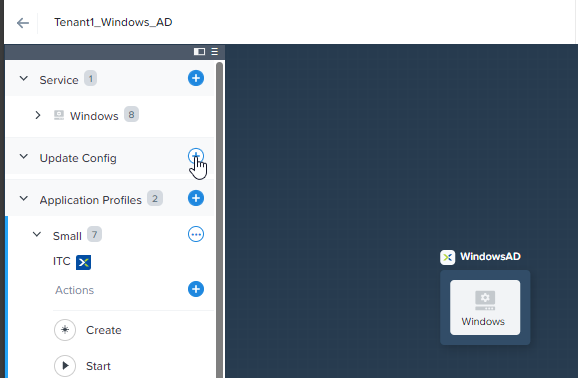
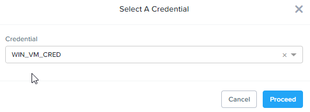

# Product Configurations:

1.  Calm VM 3.8.0 on PC2024.1
2.  Infrastructure cluster on AOS 6.8.0.5 on PC2024.1.01

# Overview

:::info

Estimated time to complete: **45 minutes**

In this exercise you will modify an existing NCM Self Service Blueprint to allow the developer to change VM specification
and take or restore snapshot in a multi-vm blueprint.  Changing VM specification and create image is built in for 
Single VM Blueprint and Application.

:::

# Configure Blueprint to change VM specification

1.  Navigate to the Windows blueprint created earlier.

2.  Click on **+** to add **Update Config**

    

3.  Change the **Name of the Update Configuration** to Change VM specification
    
    

4.  Edit the **VM Configuration** as seen in the picture below

    

5.  Click on **Save** on the top right of the screen

## Launch Blueprint to verify Change VM specification

1.  On the top right of the screen, click on **Launch**

      

2.  Fill in the following:

    -  **Application Name** -  Specify a unique name (e.g. Windows-*INITIALS*-1)
    -  **Project** - Select the project
    -  **Environment** - Select the Environment

      

3.  Select the **Application Profile**: **Small**

      

4.  Verify the VM sizing.  

     

5.  Verify the credential for the **DOMAIN_CRED**.  Click on **Deploy**

     

5.  Click on **View in Admin Center**

     

6.  Wait till the application is in the **Running** state.

## Verify Change VM specification

1.  Click on **Manage**.

     

2.  Change the memory from **2 GB** to **3 GB**.  Click on **Run**

     

3.  Click on **Audit**.  Expand on **Change VM Specification**.  Observe the change

     

4.  Click on **Services**.  Observe the change

     

# Configure Blueprint to take and restore snapshot

## Configure Replicas to the Windows VM

1.  The purpose of creating the replicas is to showcase the ability to create vm snapshots on multiple VM in 
the application.

2.  Navigate to the Windows blueprint created earlier.

3.  Click on **Service**

     

4.  Change the **default**, **Min** & **Max** as shown in the picture

     

## Configure Snapshot/Restore of the Windows VM

1.  On the left hand of the screen, click on **+** at **Snapshot/Restore**.

     

2.  Fill in the following as shown in the picture

     

## Launch Blueprint to verify VM Snapshot and Restore

1.  On the top right of the screen, click on **Launch**

      

2.  Fill in the following:

    -  **Application Name** -  Specify a unique name (e.g. Windows-*INITIALS*-1)
    -  **Project** - Select the project
    -  **Environment** - Select the Environment

      

3.  Select the **Application Profile**: **Small**

      

4.  Scroll down.  Verify the VM sizing.  

     

5.  Scroll down.  Verify the credential for the **DOMAIN_CRED**.  

     

6.  Scroll down.  Verify the Snapshot Policy for the project.

     

7.  Click on **View in Admin Center**

     

8.  Wait till the application is in the **Running** state. 

## Verify Creation of Snapshot

1.  Click on **Manage**

     

2.  Click on **Snapshot_vm_snapshot**

     

3.  Click on **Run**

     

4.  Click on **Audit**. Observe a snapshot was created for each VM

     

## Verify Restoration of Snapshot

1.  Click on **Services**.  Select one of the service.

     

2.  Click on **Open Terminal**

     

3.  Click on **Proceed**

     

4.  Make a change.  Create a file.

     

5.  Click on **Manage**.  Click on **Restore_vm_snapshot**

     

6.  Select the **Recovery Point**.  Click on **Run**

      

7. Click on **Audit**.  Observe the following:

    -  Stop the VM and remove the NIC
    -  Create a VM using the VM snapshot (Recovery Point)
    -  Delete away the old VM.

     

8.  Click on **Services**.  Select one of the **Services**.  Click on **Open Terminal**.  

     

9.  Observe the file was not created.

     