# Product Configurations:

1.  Calm VM 3.8.0 on PC2024.1
2.  Infrastructure cluster on AOS 6.8.0.5 on PC2024.1.01

# Overview

:::info

Estimated time to complete: **30 minutes**

Publishing the blueprint to the Marketplace marked a logical milestone of the blueprint development lifecycle. 
The marketplace blueprint undergoes an approval process.  An user with self service admin role can approve the 
marketplac blueprint.  Once approved, it is ready in the production for users to consume.

:::

# Publish Blueprint

1.  Login as the Blueprint Designer

    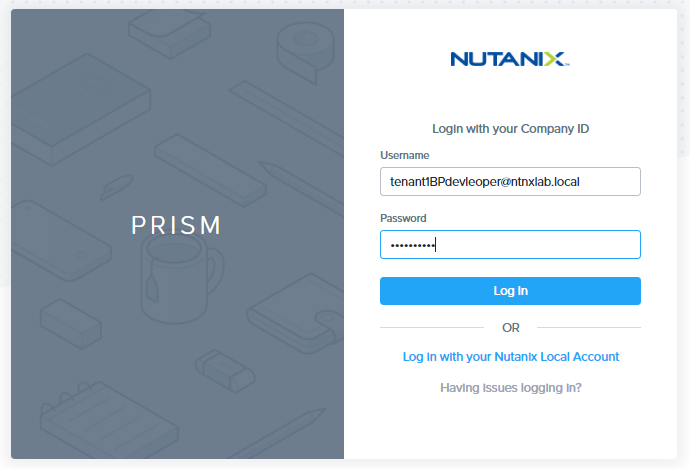

2.  Click on hamburger menu.  Select **Self Service**

    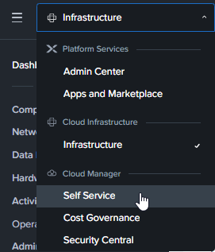

3.  Drill into the **Windows** blueprint created earlier.

    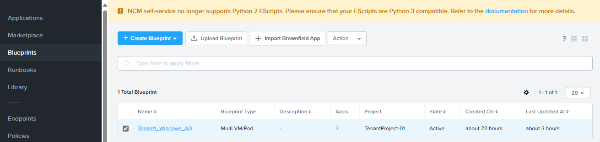

4.  Click on **Publish**

    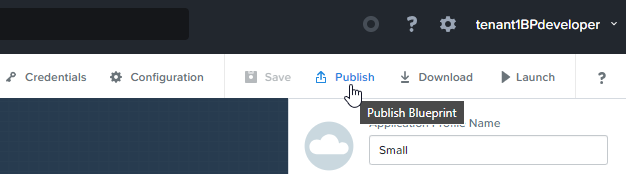

5.  Fill in the following.  Click on **Submit for Approval**

    - **Name**: Tenant**xyz**-Windows-2022
    - **Publish with secret**: checked
    - **Initial version**: 1.0
    - **Picture**: Optional

     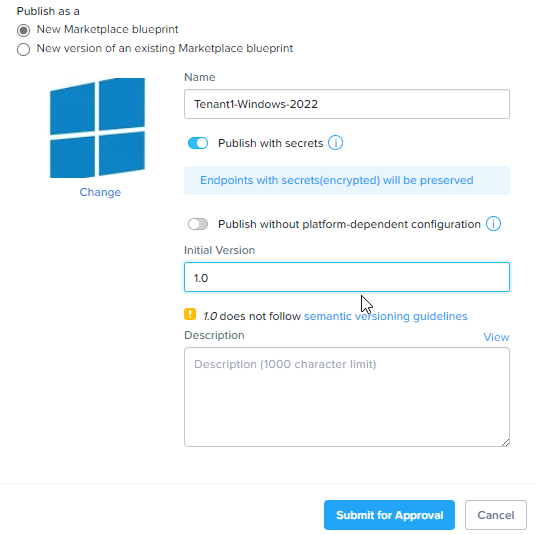

# Approve blueprint in Marketplace Manager

1.  Login as Self Service Admin

    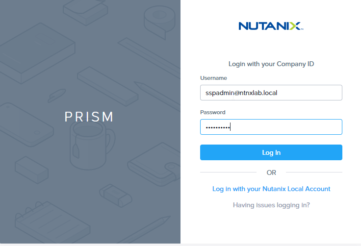

2.  Click on hamburger menu.  Select **Self Service**

    

3.  Click on **Marketplace Manager**

    

4.  Click on **Approval Pending**

    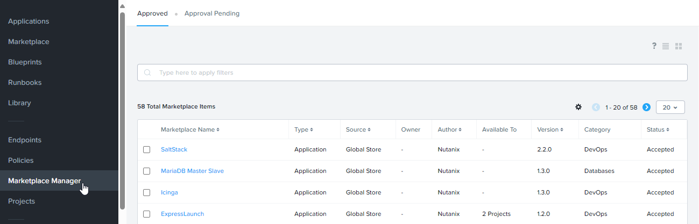

5.  Drill into the Marketplace name

    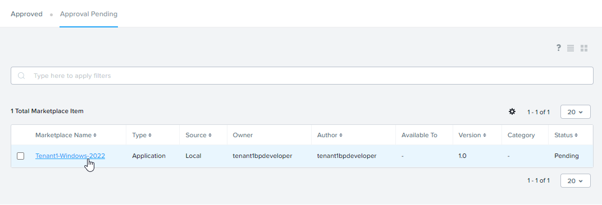

6.  Choose the following:

    - **Category**: BI-Productivity
    - **Project shared with**: **Choose your own project**

    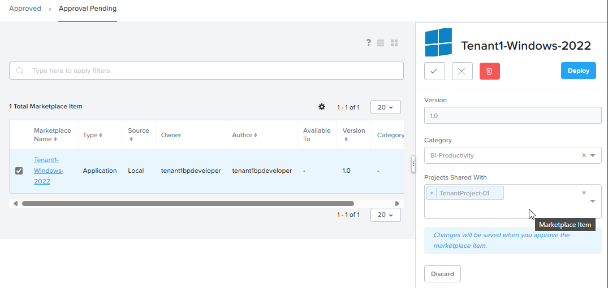

7.  Click on the **Approve** as shown in the picture

    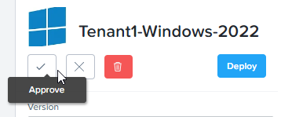

# Publish Marketplace Item to Marketplace

1.  Click on **Approved**

    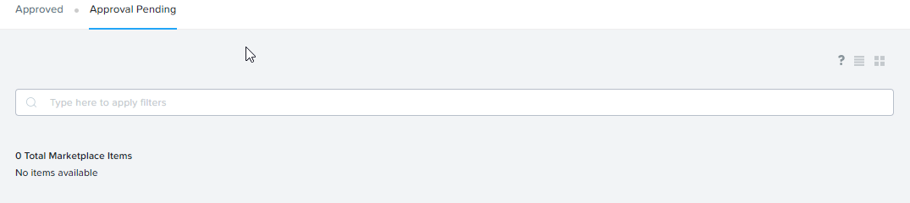

8.  Filter by **Tenant**xyz.  Click on **Marketplace Name**

    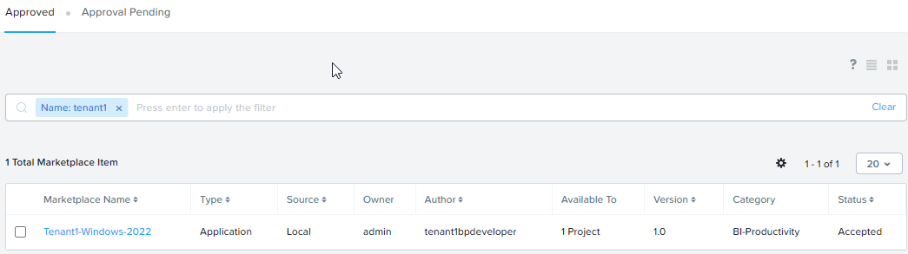

9.  Click on **Publish**

    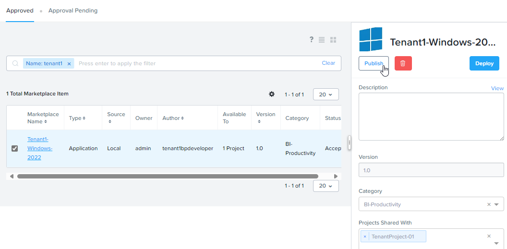

# Consume IaaS in Marketplace

1.  Login as tenant**XYZ**developer@ntnxlab.local user.  Replace XYZ with your assigned no.

    

2.  Click on hamburger menu.  Click on **Apps and Marketplace**

    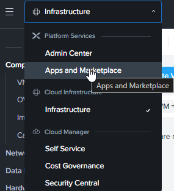

3.  Click on **Marketplace**

    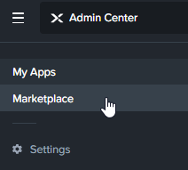

4.  Click on **Get** for **"Tenantxyz-Windows-2022'**.  Replace xyz with your initial

    

5.  Click on **Deploy**

    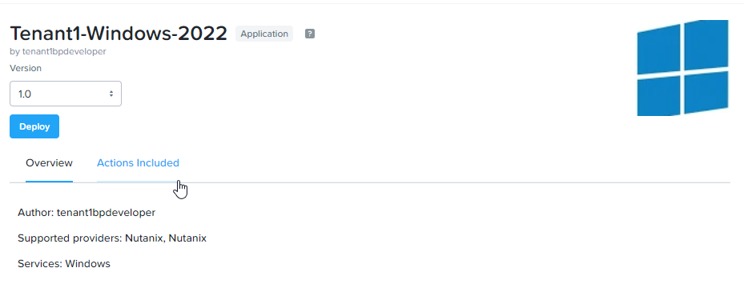

6.  Fill in the following:

    -  **Application Name** -  Specify a unique name (e.g. Windows-*INITIALS*-1)
    -  **Project** - Select the project
    -  **Environment** - Select the Environment

      

7.  Select the **Application Profile**: **Small**

      

8.  Scroll down.  Verify the VM sizing.  

     

9.  Scroll down.  Verify the credential for the **DOMAIN_CRED**.  

     

10.  Scroll down.  Verify the Snapshot Policy for the project.

    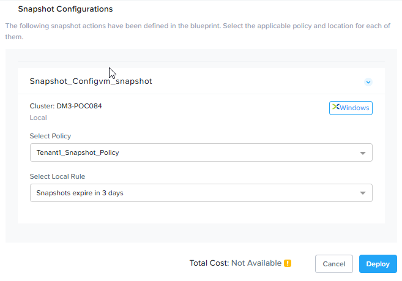 

11.  Click on **View in Admin Center**

     

12.  Wait till the application is in the **Running** state. 

