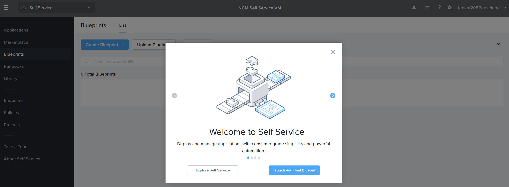
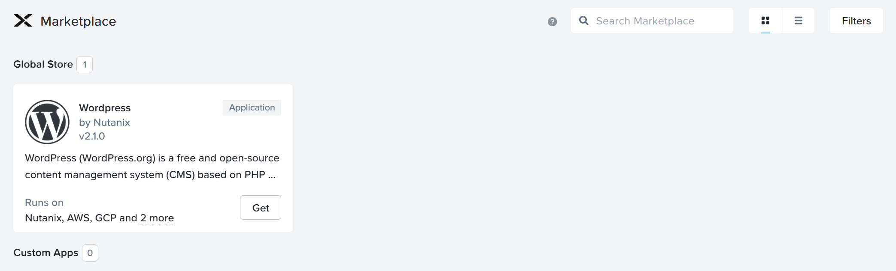
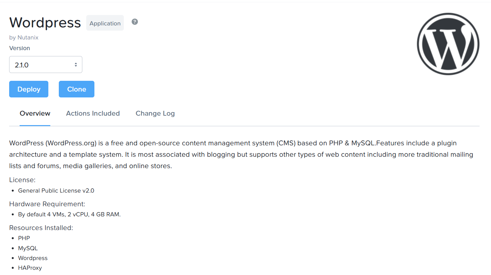
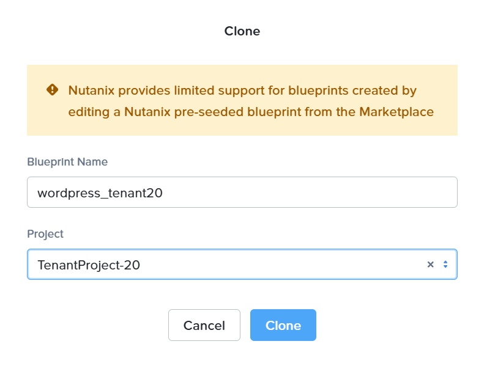
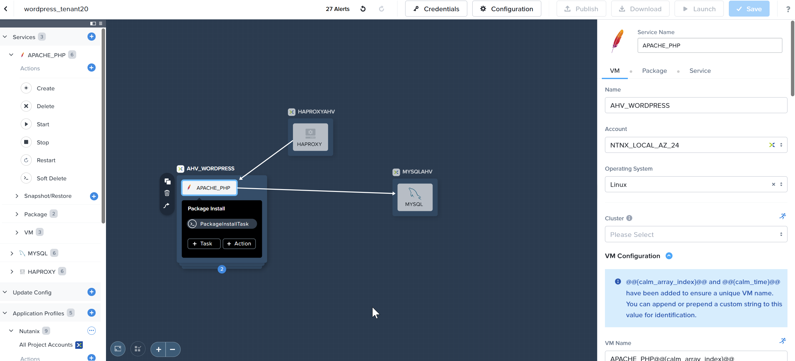

# Product Configurations:

1.  Calm VM 4.2.0 on PC7.3
2.  Infrastructure cluster on AOS 7.3 on PC7.3

# Overview

The purpose of this lab is to illustrate how a tenant can develop and publish its blueprint for the 
tenant/team consumption.

# Clone the blueprint from the marketplace

1.  Login to Self Service VM as an tenantXYZBPdeveloper@ntnxlab1.local user.  Replace XYZ with your assigned number.  

2.  This picture shows the successful login.  Click on X to close the **Welcome to Self Service**

    

3.  click on **Marketplace** on the left side of the screen

4.  Click on **Get**

    

5.  Click on **Clone**

    

6.  Fill in the following to clone the marketplace item to your project

    - **Blueprint Name**: wordpress_tenantXYZ Replace XYZ with your assigned number
    - **Project Name**: Select your project

    

    Click on **Clone**

7.  The blueprint is available in the project ready for development

    

8.  This lab will not modify the blueprint.  Please enroll for NCM 201 Lab

