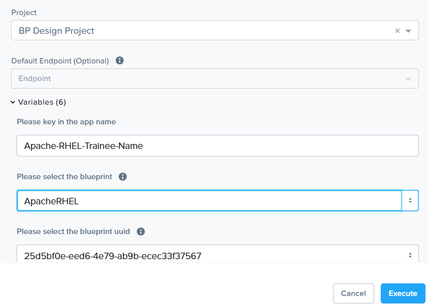

# Product Configurations:

1.  Calm VM 4.1.0 on PC2024.3.1
2.  Infrastructure cluster on AOS 7.0.5 on PC2024.3.1

## Objectives:

Unlike blueprint, runbook is not associated with the lifecycle of an application.  Runbook can be run 
independently.  The purpose of this lab is to 

a.  use runbook to launch the blueprint to provision the Apache HAProxy application.  
b.  use runbook to delete the Apache HAProxy application  

## Launch Create Apache Runbook from the marketplace.

1. Click on **Marketplace** in the left side of the screen.

2.  Click on **GET** in **Launch Create Apache Runbook**

    

3.  Click on **Execute** 

    

4.  Fill in the following.  Click on **Execute**

a.  Project: **BP Design Project**  
b.  Please key in the app name: **Apache-RHEL-Trainee-Name**  
c.  Please select the blueprint: **ApacheRHEL**  

    

5.  Runbook was launched successfully

    

6.  Click on **Application** on the left side of the screen.  Drill into the application

    

7.  The application is in **Provisioning** state

    

8.  Wait 3 to 5 mins for the application in the **Running** state.

## Launch Delete-Apache-RHEL Runbook from the marketplace.

1.  Click on **Marketplace** in the left side of the screen.

2.  Click on **GET** in **Delete-Apache-RHEL**

    

3.  Click on **Execute**

    

4.  Key in the following.  Click on **Execute**

a.  Project: **BP Design Project**  
b.  Please key in the app name: **Apache-RHEL-Trainee-Name**  
c.  Please select the blueprint: **ApacheRHEL**  

    

5.  Delete Runbook executed successfully.

    

6.  Click on **Application**.  Observe the application was deleted.