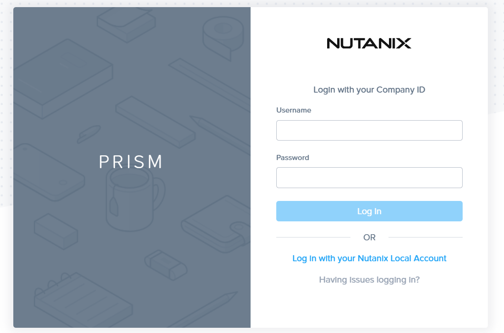
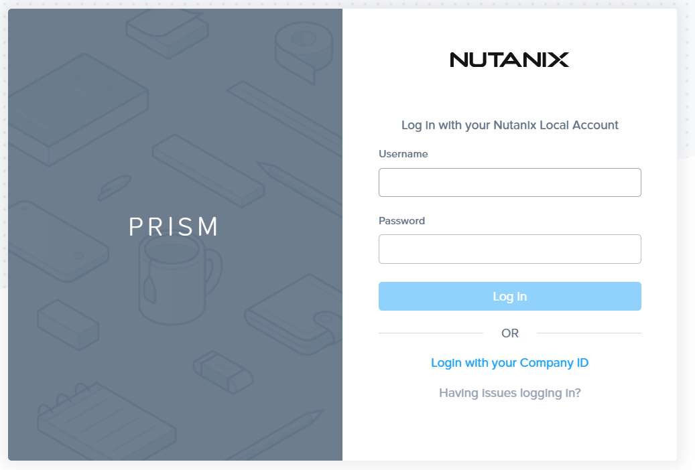
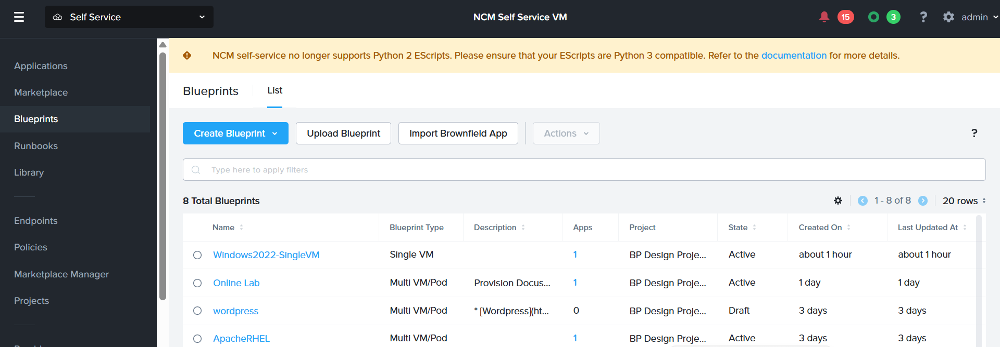

# Product Configurations:

1.  Calm VM 4.1.0 on PC2024.3.1
2.  Infrastructure cluster on AOS 7.0.5 on PC2024.3.1

## Login to NCM Self Service

Refer to the lab sheet for the IP address for the NCM Self Service

1. Click on **Login with your Nutanix Local Account**

    

2.  Fill in the credential in the lab sheet

    

3.  Login is successful

    

