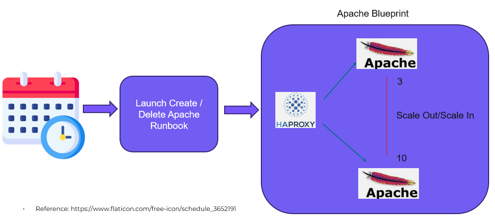
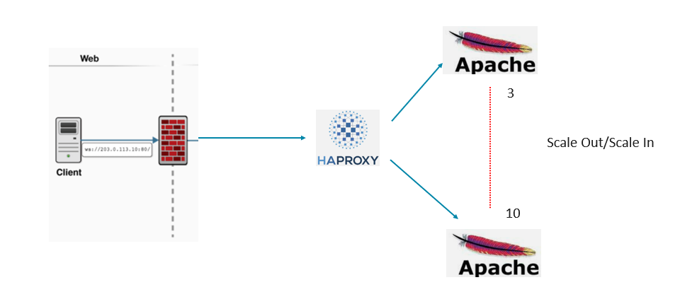
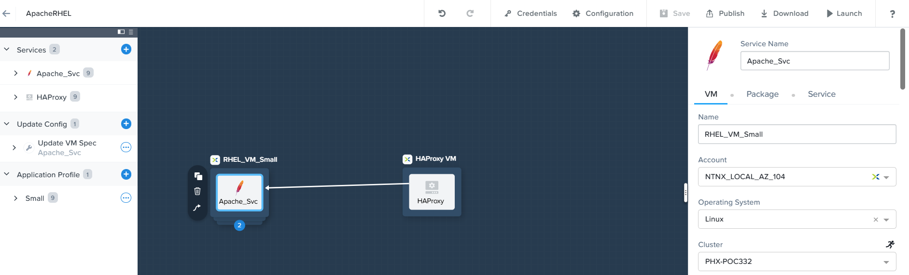

# Product Configurations:

1.  Calm VM 4.1.0 on PC2024.3.1
2.  Infrastructure cluster on AOS 7.0.5 on PC2024.3.1

## Refresh applications

One of the common use cases is to provision an application environment and destroyed on a periodic basis.  

The Refresh Application comprises of the following components.

1.  HAProxy Apache blueprint
2.  Runbook
3.  Scheduler

    

The application in this lab comprises of 1 HAProxy and 3 no of Apache Web Servers.  The no of Apache server can be scale out or scale in 
according to the demand.

    

NCM Self Service blueprint is the foundation component to provide the lifecycle management of this application.

1. Provision the Applications
2. Start, Stop or Delete the Applications
3. Scale out/Scale In the Application

    

